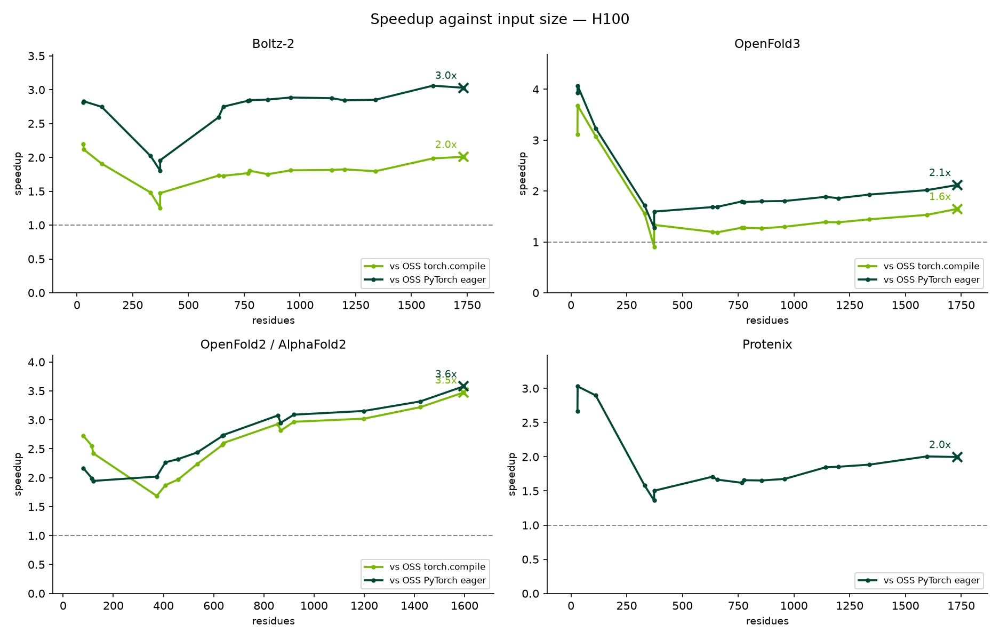

<div align="center">

# BioNeMo Inference Runtime

## Easy, fast, and memory-efficient structure prediction inference

GPU-accelerated inference for protein, nucleic-acid, and ligand structure
prediction models — from FASTA/MSA to PDB/mmCIF.



</div>

## About

BioNeMo Inference Runtime (BioIR) is NVIDIA's library for structure-prediction
inference. A five-stage GPU pipeline turns AlphaFold-lineage and all-atom models
into PDB/mmCIF with confidence scores. Models stay ordinary `nn.Module`s — no
TensorRT engine build.

## Getting Started

### Prerequisites

- **Linux, x86_64 or aarch64**, with an NVIDIA GPU.
- **Driver 580 or newer.** The dev image carries a CUDA 13.2 build of PyTorch.
  An older driver runs it only through the forward-compatibility shim, which we
  have measured hanging and crashing part-way through a run rather than merely
  running slowly — results taken on one are discarded, not corrected.
- **Python 3.12.** The released wheels are tagged `cp312`, so pip finds no
  matching build on a newer interpreter.
- **[`gh`][gh-cli] logged in** with read access to
  `NVIDIA-BioNeMo/BioNeMo-Inference-Runtime`, to download the release wheel.
- **Docker** and the **NVIDIA Container Toolkit**, to build from source in the
  dev container. Installing the wheel needs neither.

PyTorch and the CUDA math libraries arrive as wheel dependencies, or in
`nvcr.io/nvidia/pytorch:26.05-py3` when you use the container. Building the
extension from source outside a container needs a C++17 compiler and CUDA
headers as well —
[`docs/dev.md`](docs/dev.md#prerequisites-for-bioir-development-workflow).

### Release-qualified GPUs

H200, H100, A100, L40S, GB200 and GB300. Measured speedup, memory and accuracy
for each: [`docs/ref/benchmark.md`](docs/ref/benchmark.md).

BioIR runs on more than these. The
[support matrix](docs/ref/support-matrix.md#gpus) lists every architecture the
backend covers and which fused kernels apply to each; those devices work but
are not part of this release's qualification.

### Install

The wheels are attached to each [GitHub release][releases], one per base image
and CPU architecture. Download the one matching yours, check it against
`SHA256SUMS`, then rename it before installing:

```bash
gh release download 0.1.0rc1 \
  --repo NVIDIA-BioNeMo/BioNeMo-Inference-Runtime \
  --pattern '*26.05-py3_amd64_*.whl' --pattern SHA256SUMS
sha256sum --check --ignore-missing SHA256SUMS

for f in *_amd64_bionemo_ir-*.whl; do
  n=${f#*_amd64_}                  # drop the pytorch-<base>_<arch>_ prefix
  mv "$f" "${n/.cu132./+cu132.}"   # restore the "+" GitHub rewrote to "."
done

pip install ./bionemo_ir-*.whl
```

On aarch64, match `'*26.05-py3_arm64_*.whl'` and `*_arm64_*` instead.

Both renames are required, and neither is cosmetic. The asset name carries a
`pytorch-<base>_<arch>_` prefix naming the build it came from, and GitHub
rewrites `+` to `.` in asset names — so pip cannot parse the file as a wheel at
all and rejects it with *Invalid wheel filename*. Check the download before
renaming: `SHA256SUMS` lists the original names.

The wheel ships the kernels precompiled, so nothing in the install builds CUDA
and running it needs only the driver's `libcuda.so.1`. That is the whole
install if you are calling BioIR from your own code — the container below is
for working on BioIR itself.

### Build from source

Configure [SSH authentication with GitHub][github-ssh], then clone the
repository and fetch its submodules and LFS objects.

```bash
git lfs install &&
  GIT_LFS_SKIP_SMUDGE=0 \
    git clone --recurse-submodules \
      git@github.com:NVIDIA-BioNeMo/BioNeMo-Inference-Runtime.git &&
  cd BioNeMo-Inference-Runtime
```

Then, build the dev image and open a shell in it:

```bash
docker/dev.sh
```

The image carries the dependencies; your checkout is bind-mounted, so install
the package once inside and fold something:

```bash
pip install -e '.[dev]'
scripts/fetch_weights.sh --model boltz-2
python examples/folding/run_demo.py --output-dir output
```

Checkpoints come from their upstream publishers and need no NVIDIA credentials;
anything that cannot be fetched is skipped, and the tests needing it skip too.
Running `scripts/run_tests.sh` stages weights and runs the suite the way CI
does.

Building without a container needs more than a Python environment — see
[`docs/dev.md`](docs/dev.md#prerequisites-for-bioir-development-workflow) for
the prerequisites and the wheel build. The rest of that page covers daily
development; [`docs/ref/docker-images.md`](docs/ref/docker-images.md) covers the
images and what `docker/dev.sh` mounts.

## Documentation

BioIR documentation lives under [`docs/`](docs/) and is published with Fern:

- [Overview](docs/fern/pages/overview.mdx) — what BioIR is and how to start
- [Installation](docs/install.md) — requirements and release-wheel installation
- [Quickstart](docs/quickstart.md) — run a serial Boltz-2 prediction
- [Ray multi-GPU inference](docs/ray.md) — scale independent requests across
  visible GPUs
- [Developer guide](docs/dev.md) — build, test, stage weights, contribute
- [API reference](docs/ref/api.md) — `build_processor`, model constructors,
  inputs/outputs
- [Architecture](docs/ref/architecture.md) — five-stage pipeline and runtime
  design
- [Config architecture](docs/ref/config.md) — model `BaseConfig` tree and
  pipeline stage configs
- [Support matrix](docs/ref/support-matrix.md) — models, GPUs, and fused kernels
- [Benchmarks](docs/ref/benchmark.md) — measured speedup and memory against
  OSS PyTorch
- [Model weights](docs/ref/model-weights.md) — checkpoint resolution and staging
- [Docker images](docs/ref/docker-images.md) — development and runtime images
- [Coding guidelines](docs/coding.md) — style, naming, and tooling
- [Folding example](examples/folding/README.md) — runnable `build_processor`
  demo

## Benchmarks

### Methodology

Folding benchmarks over a bench set the shipped
[`rebuild_dataset.py`](.agents/skills/bench-perf-oss/dataset/) builds from RCSB
and NVIDIA's MSA Search NIM — there is no dataset release to download.
Template-bearing samples included: both sides load every bundled MSA and attach
every listed template.

- One GPU, serial, one structure per forward call.
- Time only GPU-synchronized `model.forward()`. Featurization, transfers,
  postprocessing, writing, and scoring stay outside the window.
- Discard one warmup forward, then report one measured forward per sample.
- BioIR runs its default optimized config, with a CUDA graph on the diffusion
  module where supported.
- OSS runs its own inference script: eager always, plus `torch.compile` when it
  passes a dynamic-shape probe.
- Runtime knobs match on both sides — 200 sampling steps, 3 or 5 diffusion
  samples, and per-model recycling.
- Score written structures with OpenStructure lDDT and DockQ. Speedup is
  `OSS forward / BioIR forward`; above 1 favors BioIR.
- Future work will add additional Blackwell-optimized kernels.

### Results

<!-- BEGIN generated: benchmark summary -->

| Model                           | H100          | H200          |
| ------------------------------- | ------------- | ------------- |
| Boltz-2                         | 1.78x / 2.65x | 1.74x / 2.54x |
| OpenFold3                       | 1.55x / 2.02x | 1.54x / 2.03x |
| OpenFold2 / AlphaFold2 monomer  | 2.55x / 2.60x | 2.61x / 2.66x |
| OpenFold2 / AlphaFold2 multimer | 2.66x / 2.77x | 2.61x / 2.75x |
| Protenix                        | — / 1.87x     | — / 1.84x     |

Geomean speedup, `vs OSS torch.compile / vs OSS PyTorch eager`; above 1 favours
BioIR. Protenix has no `torch.compile` path. Eleven GPUs, per-model accuracy and
peak memory, and how to reproduce any of it:
[`docs/ref/benchmark.md`](docs/ref/benchmark.md).

<!-- END generated: benchmark summary -->

The [`bench-perf-oss` agent skill](.agents/skills/bench-perf-oss/SKILL.md) has
the full gates, environment isolation, result schema, and charting protocol.

[gh-cli]: https://cli.github.com/
[releases]: https://github.com/NVIDIA-BioNeMo/BioNeMo-Inference-Runtime/releases
[github-ssh]: https://docs.github.com/en/authentication/connecting-to-github-with-ssh

## Contributing

We welcome contributions. See [`contributing.md`](docs/contributing.md) for
policy and [`docs/dev.md`](docs/dev.md) for the development workflow.

## Citation

If you use BioIR in your research, please cite it via
[`CITATION.cff`](CITATION.cff).

## Contact / Support

- Bugs and feature requests:
  [GitHub Issues](https://github.com/NVIDIA-BioNeMo/BioNeMo-Inference-Runtime/issues/new/choose)
- Usage questions:
  [GitHub Discussions](https://github.com/NVIDIA-BioNeMo/BioNeMo-Inference-Runtime/discussions)
- Security vulnerabilities: see [`SECURITY.md`](docs/SECURITY.md) — do **not**
  file a public issue

## License

NVIDIA-authored BioIR code is licensed under the [Apache License 2.0][license].
Distribution compliance material is available here:

- [Third-party notices and attributions][third-party-notices]
- [Full third-party license texts][third-party-licenses]
- [Gemmi 0.6.5 corresponding source][gemmi-source], licensed under MPL-2.0 or
  LGPL-3.0-or-later; BioIR distributes it under the MPL-2.0 option

[gemmi-source]: https://github.com/project-gemmi/gemmi/tree/v0.6.5
[license]: LICENSE
[third-party-licenses]: LICENSES
[third-party-notices]: THIRD_PARTY_NOTICES.md
