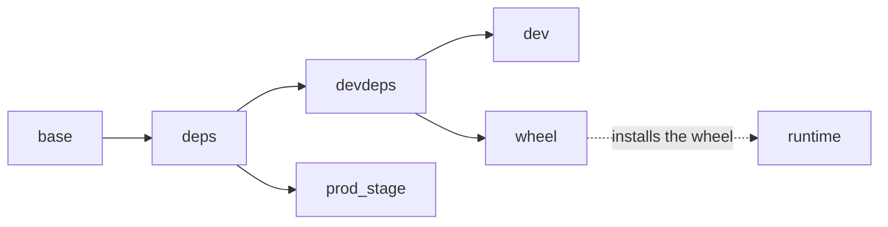

# Container images

`docker/Dockerfile` is the single source of truth for every image this project
builds. `docker/Makefile` wraps it; `.devcontainer/` consumes the `dev` target.

Every default base image pulls anonymously — none needs NVIDIA credentials.

## Stages



| Target       | Contains                              | Used for                    |
| ------------ | ------------------------------------- | --------------------------- |
| `devdeps`    | runtime + dev dependencies, no source | CI rolling build cache      |
| `dev`        | `devdeps` + a host-UID user           | daily development on a GPU  |
| `wheel`      | a source copy, builds the wheel       | producing a distributable   |
| `runtime`    | the wheel on a minimal CUDA base      | end-to-end tests, deploying |
| `prod_stage` | a source copy, non-editable install   | legacy — slated for removal |

`prod_stage` has no `make` target and nothing in this repository builds it. It
is retained only until an out-of-band downstream consumer is confirmed gone.

## Building

```bash
make -C docker help
make -C docker deps      # dependency-only image
make -C docker dev       # daily dev image
make -C docker wheel     # wheel into ./dist
make -C docker runtime   # minimal runtime image
```

Base images are overridable:

```bash
make -C docker dev BASE_IMAGE=nvcr.io/nvidia/pytorch BASE_TAG=26.05-py3
```

`deps` deliberately is not. It builds from the Dockerfile's digest-pinned
default base, which is the CUBIN compile identity the publish gate asserts; a
`--build-arg` there would let a rebased image claim it.

## Daily development

### VS Code dev container

`.devcontainer/` drives the `dev` target through Compose, so "Reopen in
Container" and `make -C docker dev` build the same image. On first create it
runs `pip install --no-build-isolation -e '.[dev]'` and `prek install`, so the
extension is compiled and the git hooks are wired before you get a prompt.

It installs only the extensions that do work the editor cannot do without — the
Python language server, Ruff, clangd, CMake file support. Anything else is a
personal preference and belongs in your own settings, not here.

`pip install -e` writes the compilation database to `compile_commands.json` at
the repo root, which is where `.clangd` looks. Until you have built once,
clangd has no flags and C++ IntelliSense stays empty — that is expected, not a
broken setup. The CMake tree it points into is kept under `build/` rather than
in pip's temporary build directory, so the flags survive the install and the
next build is incremental; delete `build/` to force a clean configure.

cmake-tools is pointed at `cpp/` but not auto-configured: the CMake tree needs
`BIOIR_CUBIN_MATERIALIZED_DIR`, which only `setup.py` supplies, so configuring
it from the extension fails.

Set `USER_UID`/`USER_GID` in `.devcontainer/.env` if yours are not 1000 (VS Code
reads that file automatically), and delete the `gpus: all` line from
`.devcontainer/docker-compose.yml` if you have no GPU. `/cache` is a named
volume, so ccache, pip and the compiled-kernel cache survive a rebuild.

### Without VS Code

`dev` deliberately does **not** contain the source or an installed package. The
checkout is bind-mounted, so an edit on the host is immediately live, and the
image stays valid across branches.

One command builds it and drops you in a shell, from anywhere in the worktree:

```bash
docker/dev.sh
```

Everything below is what [`docker/dev.sh`][dev] does, and why. It drives
`make -C docker dev` for the image — there is still one image definition in the
repo — and owns everything around it: the tag, the container, the mounts. Shell
logic belongs in a shell script that `shellcheck` and `shfmt` can read, not in a
Makefile recipe. `docker/dev.sh --help` lists its flags: `--rm` removes the
container, `--reset` replaces it, `--no-build` skips the image build.

The container is **named after the worktree directory** (`bioir-<dirname>`) and
outlives the shell. So each worktree gets its own container, a second terminal
running `docker/dev.sh` joins the one already there instead of starting a
rival, and neither trips over the other's install. The image is tagged per
worktree too (`bionemo-ir:dev-<dirname>`), so a rebuild on one branch does not
pull the rug from under a container on another; the layers are shared, so the
second tag costs nothing. When the image does change under a container — new
dependencies — the script notices and replaces it, which also costs nothing
because the container holds no state.

That is the point of the mounts: everything worth keeping is on the host.

| Host                 | Container               | Holds                                                                         |
| -------------------- | ----------------------- | ----------------------------------------------------------------------------- |
| the worktree         | `/bioir`                | the checkout, `build/`, the compiled `*.so`                                   |
| `<cache>/cache`      | `/cache`                | ccache, the pip cache, compiled CuTeDSL/Triton kernels, bash history          |
| `<cache>/home-cache` | `~/.cache`              | staged checkpoints and raw downloads, HuggingFace hub files, `prek` hook envs |

`<cache>` is `~/.cache/bionemo-ir-dev` on the host, overridable with
`BIOIR_HOST_CACHE`, and is **shared by every worktree** — weights are tens of
gigabytes and there is no reason to fetch them per branch. The script creates
those directories before starting the container: a bind mount whose source does
not exist yet is created by the daemon as `root`, and the container user then
cannot write it.

Ownership works out because the image builds a user whose UID/GID match yours
(`USER_UID`/`USER_GID`, defaulted from `id -u`/`id -g`). So what
[`scripts/fetch_weights.sh`][fetch] stages, what [`scripts/run_tests.sh`][tests]
writes and what the kernel cache accumulates all land on the host owned by you,
readable and deletable without `sudo`. If they do not match you get root-owned
`build/` and `*.so` on the host, and git reports the checkout as dubiously
owned.

`HF_TOKEN` is passed through when set, which is what gated checkpoints need;
so are `HUGGING_FACE_HUB_TOKEN`, `BIOIR_NGC_ORG`, `BIOIR_NGC_TEAM` and
`NGC_API_KEY`.

In a linked worktree, `.git` is a file pointing at an absolute path inside the
main checkout, so that path is mounted too — otherwise `git` inside the
container reports a broken repository and `prek` cannot run.

GPUs are attached when the host has the NVIDIA container runtime, and skipped
with a warning when it does not: everything except the fused kernels still runs
on the PyTorch fallbacks. `BIOIR_GPUS` overrides the detection (`none`, `all`,
`"device=0"`).

`--shm-size=10g`, `--ipc=host` and the `memlock`/`stack` ulimits match
`.devcontainer/docker-compose.yml` and the CI test job. The shm size is not
optional once the tests run under `xdist`: PyTorch's DataLoader and the parallel
workers exhaust the 64 MB default and fail in ways that look like unrelated
crashes.

The image deliberately carries no installed package, so install it once per
container:

```bash
pip install --no-build-isolation -e '.[dev]'
```

## Minimal runtime image

`runtime` installs the built wheel onto `nvidia/cuda:*-base` — no `nvcc`, no
CUDA toolkit. That is sufficient because:

- the extension links exactly one CUDA library, `libcuda.so.1`, which the
  container toolkit injects from the host driver;
- it loads already-compiled CUBINs through `cuModuleLoadData`, so the driver
  never JITs — no `nvrtc`, no `nvJitLink`;
- torch ships its own `cudart`/`cublas`/`cudnn` as PyPI wheels, so a CUDA
  `runtime` base would ship a second, unused copy of all of them.

The build asserts the wheel carried the compiled extension and that the only
CUDA library it needs is `libcuda.so.1`. It cannot import it: `dlopen` must
resolve `libcuda.so.1`, which the container toolkit injects from the host driver
only at `docker run --gpus` — never at build time. Verify the import at run
time, which is also the check that catches a module that only worked because the
source tree happened to be on `sys.path`:

```bash
make -C docker runtime TAG=local
docker run --rm --gpus all bionemo-ir:runtime-local \
    python -c "import bionemo_ir; print(bionemo_ir.__version__)"
```

Requires a driver new enough for the shipped CUBINs. The base image declares its
CUDA and driver requirement as image labels, and the container toolkit enforces
them at `docker run`.

## Notes

- `nvcc` is never used to compile CUDA here — the kernels ship precompiled. It
  is only read to stamp the wheel's `+cuXYZ` local version, and `CUDA_TAG`
  overrides that:

  ```bash
  make -C docker wheel CUDA_TAG=cu130
  ```

- The `wheel` stage needs `.dockerignore` to stay accurate; it does a `COPY .`.
- `deps` is keyed by `BASE_TAG`, not by commit, so it rebuilds only when
  `requirements.txt` or `requirements-dev.txt` changes.

[dev]: dev.sh
[fetch]: ../scripts/fetch_weights.sh
[tests]: ../scripts/run_tests.sh
