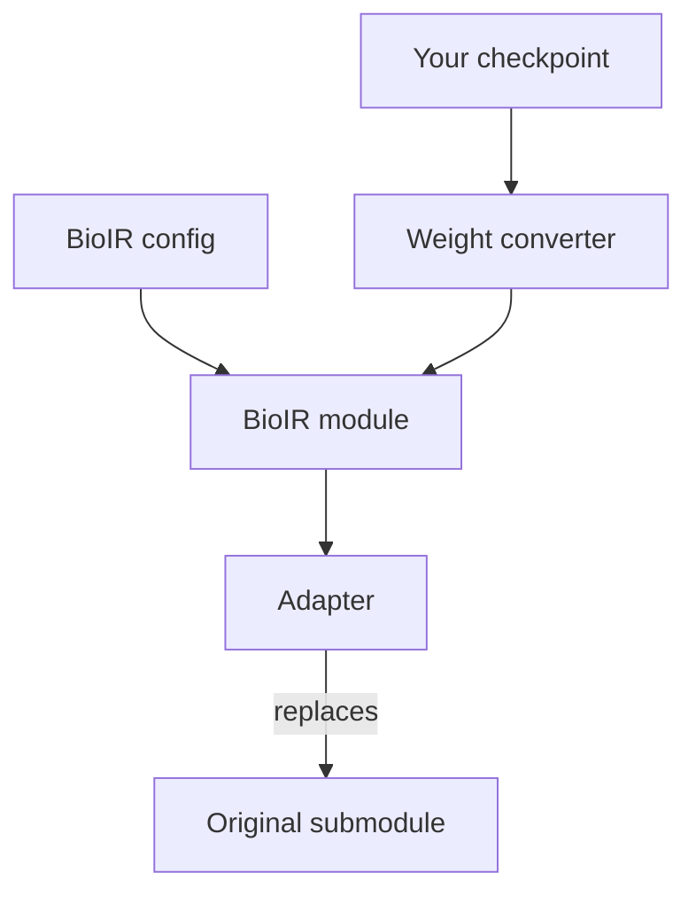

# Accelerate a Custom Model with BioIR Modules

BioNeMo Inference Runtime (BioIR) ships optimized versions of the modules
that dominate structure-model inference: Pairformer and Evoformer stacks,
diffusion transformers, and atom transformers. You can use them inside a
model that BioIR does not support. In this guide, you replace one module of
your trained PyTorch model with its BioIR equivalent and convert the
checkpoint weights. Then you verify that the swapped model computes the same
function as the original.

The result is still your model: the same `nn.Module`, data loading, and
calling code, with one faster submodule. This workflow does not use
`build_processor` or the BioIR data pipeline. To run a complete model through
the BioIR pipeline instead, refer to [Port a Data Pipeline][port].

The running example swaps the Pairformer stack of RoseTTAFold3 (RF3), an
open-source all-atom structure model under the BSD-3-Clause license. The
complete code for the RF3 Pairformer swap is in the
[module onboarding example][examples] under `examples/module_onboarding/`.

[port]: port-data-pipeline.md
[examples]: ../../examples/module_onboarding/

## How a Swap Fits Together

A swap has four parts. You write each part once per module type:

- **Config.** A BioIR config, such as `PairformerConfig`, carries your
  module's dimensions, head counts, dtype, and attention backends.
- **Weight converter.** A function renames and fuses your checkpoint tensors
  into the BioIR module's parameter layout.
- **Adapter.** A thin `nn.Module` with your module's `forward` signature
  translates masks and tensor shapes, and then calls the BioIR module.
- **Swap function.** A function builds the BioIR module from the config,
  loads the converted weights, wraps the module in the adapter, and assigns
  the adapter in place of the original submodule.

The following diagram shows how the parts connect:



## Before You Begin

Complete the following before you swap a module:

- Install BioIR on a machine with a supported GPU, as described in
  [Installation][install]. From a repository checkout, run
  `uv sync --locked`.
- Make your model's source importable in the same environment. Install only
  the packages that the module you are replacing imports, not your model's
  full dependency set. If a package requires a different PyTorch version than
  BioIR, resolve the conflict first. Force-installing over BioIR's environment
  breaks it.
- Decide which weights to test with. Random weights are enough to validate
  the conversion and the adapter. Randomize every source parameter, including
  those that your model initializes to zero or one, such as output
  projections and gate biases. A zero-initialized branch contributes nothing
  and hides conversion errors. Use a real checkpoint before you trust
  accuracy or benchmark numbers.
- Keep your work outside the BioIR source tree. Import `bionemo_ir` as a
  package, and do not edit it.

[install]: ../install.md

The following layout matches the example:

```text
my_onboarding/
├── convert/
│   └── convert_weights.py   # your checkpoint -> BioIR layout
├── integration/
│   ├── config.py            # BioIR config from your hyperparameters
│   ├── adapter.py           # your forward signature -> BioIR forward
│   └── swap.py              # build, load, wrap, replace
├── tests/                   # equivalence tests
└── benchmarks/              # optional timing scripts
```

Run your code with `my_onboarding/` on `PYTHONPATH`, so that `convert` and
`integration` import as they do in the following examples.

## Map Your Module Onto BioIR Layers

Read your module's `__init__` and `forward`. List every submodule, the order
in which `forward` calls them, and the residual connections between them.
Then find a BioIR counterpart for each submodule.

Matching a whole stack is the simplest swap. Start with the composite stacks
in the following modules of `bionemo_ir._torch.layers.transformers`:

- `pairformer.py` — `PairformerModule`, a Pairformer stack of
  `PairformerLayerV1` or `PairformerLayerV2` layers, and
  `PairformerNoSeqModule` for pair-only stacks.
- `evoformer.py` — `EvoformerStack`, Evoformer blocks with multiple sequence
  alignment (MSA) and pair tracks.
- `diffusion_transformer.py` — `BoltzDiffusionTransformer`,
  `OpenFold3DiffusionTransformer`, and `ProtenixDiffusionTransformer`,
  diffusion token transformers built from `DiffusionTransformerLayer`.
- `atom.py` — `AtomTransformer`, `AtomAttentionEncoder`, and
  `AtomAttentionDecoder`, atom-level transformers.

The package exports `PairformerModule`, `EvoformerStack`,
`BoltzDiffusionTransformer`, and `OpenFold3DiffusionTransformer`. Import the
other classes from their modules, such as
`bionemo_ir._torch.layers.transformers.pairformer`.

When no stack matches, go one level down to the primitives in
`bionemo_ir._torch.layers`:

- `triangle_nodes.py` — `TriangleMultiplicationNode`,
  `TriangleAttentionStartingNode`, and `TriangleAttentionEndingNode`
- `attention.py` — `AttentionPairBias` and `TriangleAttention`
- `transition.py` — `Transition` and `ConditionedTransitionBlock`
- `normalization.py` — `AdaLN`

If you installed BioIR from a wheel, the Python sources ship with it. Print
the package directory and read the files there:

```bash
python -c "import bionemo_ir, os; print(os.path.dirname(bionemo_ir.__file__))"
```

For RF3's `PairformerBlock`, every submodule has a counterpart in
`PairformerLayerV1`, so the whole stack maps onto `PairformerModule`:

- `tri_mul_outgoing` and `tri_mul_incoming` become `tri_mul_out` and
  `tri_mul_in`.
- `tri_attn_start` and `tri_attn_end` keep their names.
- `z_transition` and `s_transition` become `transition_z` and
  `transition_s`.
- `attention_pair_bias` becomes `attention`.

Matching names is not enough. Read the code path that your model runs at
inference. The following three RF3 details load without error and change the
output:

- RF3's triangle attention adds biases to its gate and output projections.
  BioIR's triangle attention nodes support them, but `PairformerConfig` does
  not expose them, so the example rebuilds those nodes. For details, refer to
  [Options the Config Does Not Expose](#options-the-config-does-not-expose).
- RF3's ending node projects its triangle bias before it transposes the pair.
  Setting `tri_attn_transposed_bias=True` does the same in BioIR.
- RF3's default cuEquivariance kernel sums the triangle product over the
  third token, and its PyTorch fallback divides that sum by the token count.
  BioIR sums by default, and `trimul_mean_normalization=True` divides.

A submodule without a counterpart stays in your original PyTorch, and the
rest of the module can still convert. Expect a gap in the following cases:

- No BioIR layer implements the operation, such as a novel gating or
  geometric layer.
- The math differs. BioIR's `Transition` is SwiGLU, so a GELU transition
  does not map onto it.
- The residual structure differs, such as attention and transition outputs
  added to the same block input instead of in sequence.
- Your dimensions break a BioIR layout assumption, such as a hidden size
  that is not divisible by the head count.
- Your attention pattern, such as windowed or sparse attention, has no
  BioIR attention backend.
- Your module returns extra outputs that downstream code consumes, or it
  places normalization where the BioIR layer does not.

RF3's diffusion transformer is such a gap. Its blocks normalize the queries
and keys. They also add the attention and transition outputs to the same
block input. `DiffusionTransformerLayer` runs attention and transition in
sequence and has no switch for query and key normalization, so it cannot
stand in for an RF3 block. Converting it means composing primitives such as
`AttentionPairBias` and `ConditionedTransitionBlock` in a block of your own.

Leave training-only behavior behind, such as dropout, activation
checkpointing, and auxiliary losses. BioIR modules are inference-only.

## Build the Config

Create the BioIR config from your module's hyperparameters. The RF3 example
builds a `PairformerConfig` in `rf3_pairformer/integration/config.py`:

```python
from bionemo_ir.configs.modules import PairformerConfig


def make_rf3_pairformer_config(
    num_blocks: int = 48,
    c_s: int = 384,
    c_z: int = 128,
    num_heads: int = 16,
    pairwise_head_width: int = 32,
    pairwise_num_heads: int = 4,
    dtype: str = "bfloat16",
    # Portable on every supported GPU. CuTeDSL is faster on GPUs that support it.
    triangle_attention_backend: str = "CUEQUIV",
    pairwise_attention_backend: str = "SDPA",
    # RF3's default cuEquivariance triangle multiplication sums over the third
    # token; its PyTorch fallback divides the sum by the token count. Set True
    # only to compare against the fallback.
    trimul_mean_normalization: bool = False,
) -> PairformerConfig:
    return PairformerConfig(
        num_blocks=num_blocks,
        token_s=c_s,
        token_z=c_z,
        num_heads=num_heads,
        pairwise_head_width=pairwise_head_width,
        pairwise_num_heads=pairwise_num_heads,
        dtype=dtype,
        triangle_attention_backend=triangle_attention_backend,
        pairwise_attention_backend=pairwise_attention_backend,
        trimul_mean_normalization=trimul_mean_normalization,
        # RF3's ending node projects its triangle bias before transposing the pair.
        tri_attn_transposed_bias=True,
        attention_initial_norm=True,
        version="v1",
    )
```

The fields have the following meanings:

- `token_s` and `token_z` — widths of the single and pair representations.
- `num_heads` — heads of the attention with pair bias on the single track.
- `pairwise_head_width` and `pairwise_num_heads` — head shape of triangle
  attention on the pair track.
- `dtype` — parameter and activation dtype. Use `bfloat16` for inference.
- `triangle_attention_backend` and `pairwise_attention_backend` — the
  implementations of triangle attention and of the attention with pair bias.
  Each layer binds its backends when it is constructed.
- `trimul_mean_normalization` and `tri_attn_transposed_bias` — the triangle
  multiplication and triangle attention variants from
  [Map Your Module Onto BioIR Layers](#map-your-module-onto-bioir-layers).
- `version` — `"v1"` builds `PairformerLayerV1` layers. Any other value,
  including `"V1"`, builds `PairformerLayerV2`.

Every attention backend computes the same function. The backends differ in
speed, memory, and dtype support. Backend names are case-sensitive:

- `VANILLA` — the pure-PyTorch reference, for any GPU and dtype.
- `SDPA` — PyTorch scaled dot-product attention, for any GPU and dtype.
- `CUEQUIV` — cuEquivariance, for triangle attention only.
- `CuTeDSL` — BioIR kernels for `float16` and `bfloat16` on supported GPUs.

Validate numerics with a portable backend first. Then switch to the fastest
backend for your GPU, which the auto-select functions choose, and rerun the
tests:

```python
import torch

from bionemo_ir._torch.attention_backend import (
    auto_select_pairwise_attention_backend,
    auto_select_triangle_attention_backend,
)

config = make_rf3_pairformer_config(
    triangle_attention_backend=auto_select_triangle_attention_backend(torch.bfloat16),
    pairwise_attention_backend=auto_select_pairwise_attention_backend(torch.bfloat16),
)
```

For the GPUs that take each path, refer to [Fused Kernels][support-matrix] in
the support matrix. For how BioIR chooses and binds backends, refer to
[Attention Backends][backends].

[support-matrix]: ../ref/support-matrix.md#fused-kernels
[backends]: ../ref/architecture.md#attention-backends

### Options the Config Does Not Expose

A config sets only the options that its module passes to its layers. Sometimes
your model needs an option that a BioIR node supports but the config does not
expose. In that case, build the module, and then rebuild that node with the
arguments that its layer passes, plus the option. RF3's triangle attention
biases are one such case. The following code from
`rf3_pairformer/integration/swap.py` rebuilds those nodes:

```python
from bionemo_ir._torch.layers.transformers.pairformer import PairformerModule
from bionemo_ir._torch.layers.triangle_nodes import TriangleAttentionEndingNode, TriangleAttentionStartingNode

# RF3's triangle attention has biases on its gate and output projections.
TRIANGLE_ATTENTION_BIASES = {"q": False, "k": False, "v": False, "g": True, "o": True}


def build_pairformer_module(config):
    module = PairformerModule(config)
    shape = (config.token_z, config.pairwise_head_width, config.pairwise_num_heads)
    for i, layer in enumerate(module.layers):
        options = {
            "inf": config.mask_inf,
            "layer_idx": i,
            "dtype": config.torch_dtype,
            "skip_create_weights": config.skip_create_weights,
            "attn_backend": config.triangle_attention_backend,
            "mha_bias_flags": TRIANGLE_ATTENTION_BIASES,
        }
        layer.tri_attn_start = TriangleAttentionStartingNode(*shape, **options)
        layer.tri_attn_end = TriangleAttentionEndingNode(
            *shape, transposed_bias=config.tri_attn_transposed_bias, **options
        )
    return module
```

Copy the arguments from the layer's constructor, here `PairformerLayerV1` in
`pairformer.py`. Then test the result with every backend that you deploy, as
described in [Verify the Numerics](#verify-the-numerics).

## Convert the Weights

Put the two parameter lists side by side. In the following example,
`original` is the module that you are replacing, with its weights loaded:

```python
from integration.swap import build_pairformer_module

print(sorted(original.state_dict()))
print(sorted(build_pairformer_module(config).state_dict()))
```

Every difference between the lists falls into one of four kinds.

**Renames.** The tensor is the same, and only the name differs. For example,
`tri_mul_outgoing` becomes `tri_mul_out`, and `to_out` becomes `mha.o_proj`.

**Fusions.** BioIR concatenates related projections into one matrix, so one
matrix multiply replaces several. Concatenate along dimension 0 in the
following order:

- Triangle attention: query, key, value, and gate projections into
  `mha.in_proj`. The pair-bias projection goes, unpadded, to the node's
  `pair_bias_proj`.
- Attention with pair bias: query, gate, key, and value into `in_proj`. Its
  bias spans all four, so fill zeros where your model has none.
- Transition: the plain projection, then the SiLU-activated gate projection,
  into `fused_fc2_fc1`. BioIR applies SiLU to the second half.
- AdaLN: gain, then bias projection, into `fused_s_scale_s_bias`.

A wrong order loads without error and computes wrong numbers. The tests in
[Verify the Numerics](#verify-the-numerics) catch it.

**Shape changes.** Transpose or reshape a tensor when the two layouts store
it differently.

**Unmatched parameters.** A BioIR parameter with no counterpart in your
checkpoint needs a neutral value. For example, RF3's attention has no query
bias, so the converter sets `proj_q.bias` to zeros. A checkpoint tensor with
no BioIR counterpart needs a decision, because dropping a nonzero bias
changes the output. The example keeps RF3's triangle attention biases by
rebuilding those nodes rather than dropping them. Account for every source
key, and let the tests confirm the choice.

The RF3 converter builds the mapping from one small function per submodule.
The following transition converter shows a rename and a fusion. RF3 computes
`linear_3(silu(linear_1(x)) * linear_2(x))`, so `linear_1` is the gate:

```python
import torch


def convert_transition_weights(state_dict, prefix, bioir_prefix):
    gate_weight = state_dict[f"{prefix}.linear_1.weight"]  # SiLU-activated
    value_weight = state_dict[f"{prefix}.linear_2.weight"]
    fused_weight = torch.cat([value_weight, gate_weight], dim=0)  # gate second

    return {
        f"{bioir_prefix}.norm.weight": state_dict[f"{prefix}.layer_norm_1.weight"],
        f"{bioir_prefix}.norm.bias": state_dict[f"{prefix}.layer_norm_1.bias"],
        f"{bioir_prefix}.fused_fc2_fc1.weight": fused_weight,
        f"{bioir_prefix}.fc3.weight": state_dict[f"{prefix}.linear_3.weight"],
    }
```

A block converter calls one such function per submodule, and a stack
converter loops over blocks, mapping `pairformer_stack.{i}` to `layers.{i}`.

If your checkpoint uses Boltz key names, such as `mha.linear_q` and `fc1`,
reuse BioIR's helpers instead of writing your own:
`get_tri_attn_node_weights`, `get_tri_mul_node_weights`, and
`get_transition_weights` in `bionemo_ir/models/boltz1/convert.py`. They map
weights only. OpenFold's triangle attention also has gate and output biases.
Those need your own mapping and the node rebuild from
[Options the Config Does Not Expose](#options-the-config-does-not-expose).

Check completeness in both directions before you compare any numbers: every
BioIR parameter gets a tensor, and the converter reads every source tensor.
The following code example uses a recording dict to catch source tensors
that the converter skips:

```python
class KeyRecorder(dict):
    """A state dict that records which keys the converter reads."""

    def __init__(self, *args):
        super().__init__(*args)
        self.read = set()

    def __getitem__(self, key):
        self.read.add(key)
        return super().__getitem__(key)


source = KeyRecorder(recycler.state_dict())
converted = convert_pairformer_stack_weights(source, num_blocks=48)
bioir = build_pairformer_module(config)
expected = bioir.state_dict()

missing = expected.keys() - converted.keys()
unexpected = converted.keys() - expected.keys()
unread = {key for key in source if key.startswith("pairformer_stack.")} - source.read
assert not missing and not unexpected and not unread, (sorted(missing), sorted(unexpected), sorted(unread))
for name, tensor in converted.items():
    assert tensor.shape == expected[name].shape, name

bioir.load_state_dict(converted, strict=True)
```

`load_state_dict` copies each tensor into the module's dtype, and
`strict=True` fails on any missing or unexpected key. BioIR modules also
expose a `load_weights` method, which BioIR's own model loaders use. It
takes weights grouped per submodule rather than a flat state dict, so a
converter like this one loads with `load_state_dict`.

## Write the Adapter

The adapter keeps your model's calling code unchanged. It has the exact
`forward` signature that the caller uses and translates between the two
conventions:

- **Masks.** Many models pass a padding mask where `True` marks padding.
  BioIR takes a float mask where `1.0` marks a valid position, plus a pair
  mask for pair tensors. BioIR's fast paths assume the valid positions come
  first and the padding last, so keep padding at the end. In
  `PairformerModule`, padding in the middle of a sequence gives wrong
  `bfloat16` results, and CuTeDSL rejects it.
- **Arguments.** BioIR `forward` methods accept optional extras, such as
  attention metadata and preallocated buffers. Leave them at their defaults.
- **Shapes and return values.** Add or fold axes, such as a missing batch
  axis or a diffusion-sample axis, and return what the caller expects.
- **Precision.** BioIR fixes its dtypes when a module is constructed. Cast
  inputs to the module's dtype, cast outputs back, and keep the caller's
  autocast out of the BioIR module.

RF3's Recycler calls each Pairformer block as `block(S_I, Z_II)`, with one
unbatched structure, no padding mask, and `bfloat16` autocast. The following
RF3 Pairformer adapter from `rf3_pairformer/integration/adapter.py` handles
all three:

```python
import torch
import torch.nn as nn

from bionemo_ir._torch.layers.transformers.pairformer import PairformerModule


class RF3PairformerAdapter(nn.Module):
    """Stands in for RF3's whole pairformer_stack, called like one PairformerBlock."""

    def __init__(self, bioir_module: PairformerModule):
        super().__init__()
        self.module = bioir_module
        self.dtype = bioir_module.config.torch_dtype

    def forward(self, S_I, Z_II):
        unbatched = Z_II.ndim == 3
        if unbatched:  # RF3 runs one structure without a batch axis
            S_I, Z_II = S_I[None], Z_II[None]

        # RF3 passes no padding mask: every token is valid.
        mask = torch.ones(S_I.shape[:-1], dtype=torch.float32, device=S_I.device)
        pair_mask = mask[..., :, None] * mask[..., None, :]

        # BioIR fixes its dtypes at construction, so keep the caller's autocast out.
        with torch.autocast(device_type=Z_II.device.type, enabled=False):
            s, z = self.module(S_I.to(self.dtype), Z_II.to(self.dtype), mask, pair_mask)
        s, z = s.to(S_I.dtype), z.to(Z_II.dtype)

        if unbatched:
            s, z = s[0], z[0]
        return s, z
```

Do not add dropout to an adapter.

## Swap the Module

The swap function assembles the parts and replaces the submodule in place.
Replace the submodule the way its caller uses it. RF3's Recycler iterates
`pairformer_stack`, so the swap installs a one-element `ModuleList` whose
adapter runs every layer. The following code is abridged from
`rf3_pairformer/integration/swap.py`:

```python
import torch.nn as nn


def swap_pairformer_stack(recycler, source_state_dict, num_blocks=48, device="cuda", **config_kwargs):
    config = make_rf3_pairformer_config(num_blocks=num_blocks, **config_kwargs)
    module = build_pairformer_module(config)
    converted = convert_pairformer_stack_weights(source_state_dict, num_blocks=num_blocks)
    # The converter returns flat parameter names, so load it as a state dict.
    # PairformerModule.load_weights takes per-submodule groups.
    module.load_state_dict(converted, strict=True)

    # The Recycler runs `for block in self.pairformer_stack: S_I, Z_II = block(S_I, Z_II)`,
    # so a one-element ModuleList holds the adapter, which runs every layer.
    recycler.pairformer_stack = nn.ModuleList([RF3PairformerAdapter(module.to(device).eval())])
    return recycler
```

Call it on a loaded model before inference. Read the state dict first,
because the swap discards the original module:

```python
# recycler: the RF3 Recycler that owns pairformer_stack, with weights loaded
swap_pairformer_stack(recycler, source_state_dict=recycler.state_dict())
recycler.eval()
```

BioIR allocates parameters without initializing them, so load weights before
any forward pass. A module without loaded weights can return NaN.

## Verify the Numerics

Test from the bottom up, and do not move to the next level until the current
one passes. At every level, feed identical weights and identical inputs to
the original module and to the BioIR path. Test the following levels in
order:

1. **Submodule.** Test one primitive at a time on small tensors, for example,
   32 tokens with width 64. Primitives include triangle multiplication,
   triangle attention, attention with pair bias, and transitions. Some
   primitives take inputs that their stack prepares once per forward pass.
   For example, call `TriangleMultiplicationNode` as
   `node(z, pair_mask, metadata)`, with
   `metadata = precompute_trimul_metadata(z, None, None)` from
   `bionemo_ir._torch.layers.triangle_nodes`.
2. **Layer.** Test one full block through the adapter.
3. **Stack.** Test two or three stacked blocks at representative sizes, and
   check that the error does not grow from block to block.
4. **Round trip.** Convert, load, read back `state_dict()`, and compare the
   result with the converted tensors.

Choose tolerances by what differs between the two paths:

- **Same math and precision**, such as `float32` with the `VANILLA` backend:
  use `torch.testing.assert_close` with `atol=1e-3, rtol=1e-3` for a
  submodule and `atol=1e-2, rtol=1e-2` for a layer.
- **Different kernels or reduced precision**, such as `bfloat16` with
  CuTeDSL: require a relative root-mean-square error (RMSE) below 0.05.

The following function computes the relative RMSE:

```python
import torch


def relative_rmse(actual: torch.Tensor, expected: torch.Tensor) -> float:
    actual, expected = actual.double(), expected.double()
    return ((actual - expected).pow(2).mean().sqrt() / expected.pow(2).mean().sqrt()).item()
```

The following layer test checks the RF3 Pairformer. In it, `source_block` is
one RF3 `PairformerBlock` with its weights loaded. Like the adapter, it takes
unbatched tensors and no mask. RF3's attention with pair bias casts to
`bfloat16`, and its cuEquivariance kernels require `bfloat16`, so the test
switches RF3 to its `float32` PyTorch paths. That path's triangle
multiplication divides by the token count, so the test sets
`trimul_mean_normalization=True`:

```python
import torch

from convert.convert_weights import convert_pairformer_block_weights
from integration.adapter import RF3PairformerAdapter
from integration.config import make_rf3_pairformer_config
from integration.swap import build_pairformer_module


@torch.no_grad()
def check_one_block(source_block, num_tokens=64):
    # Compare in float32 on RF3's PyTorch paths: its pair-bias attention
    # casts to bfloat16, and its cuEquivariance kernels require bfloat16.
    for module in source_block.modules():
        if hasattr(module, "force_bfloat16"):
            module.force_bfloat16 = False
        if hasattr(module, "use_cuequivariance"):
            module.use_cuequivariance = False
    source_block = source_block.float().cuda().eval()

    config = make_rf3_pairformer_config(
        num_blocks=1,
        dtype="float32",
        triangle_attention_backend="VANILLA",
        pairwise_attention_backend="VANILLA",
        trimul_mean_normalization=True,  # RF3's PyTorch path divides by the token count
    )
    bioir = build_pairformer_module(config)
    bioir.load_state_dict(convert_pairformer_block_weights(source_block.state_dict(), bioir_prefix="layers.0"))
    adapter = RF3PairformerAdapter(bioir.cuda().eval())

    torch.manual_seed(0)
    s = torch.randn(num_tokens, 384, device="cuda")
    z = torch.randn(num_tokens, num_tokens, 128, device="cuda")

    s_ref, z_ref = source_block(s, z)
    s_out, z_out = adapter(s, z)
    torch.testing.assert_close(s_out, s_ref, atol=1e-2, rtol=1e-2)
    torch.testing.assert_close(z_out, z_ref, atol=1e-2, rtol=1e-2)
```

If your model pads, add padding at the end of the sequence, pass the same
mask to both sides, and compare only the valid positions.

After the `float32` tests pass, repeat the layer and stack tests in
`bfloat16` with the backends that you deploy, and judge them by relative
RMSE. For RF3, compare against its default path, which runs cuEquivariance
under `bfloat16` autocast, and keep the default
`trimul_mean_normalization=False`.

## Benchmark the Swap

Benchmarking is optional. After the numerics pass, measure what the swap
gains you. Run in `bfloat16`, and compare against your model's best existing
inference setup rather than a naive eager baseline. That setup includes its
default kernels, attention implementation, and `torch.compile` settings.

Measure with the following method:

- Stack at least eight layers and feed each layer's output into the next. A
  single layer understates activation memory and overstates throughput.
- Load the same converted weights into every configuration, so only the
  execution path differs.
- Sweep the token count from 128 to 2048 in steps of 128. When a
  configuration runs out of memory, record the out-of-memory error and stop
  that configuration.
- Run under `torch.no_grad()` with the modules in `eval()` mode. Warm up
  three times, time 10 runs, and report the median.
- Call `torch.cuda.reset_peak_memory_stats()` before each configuration and
  record `torch.cuda.max_memory_allocated()` after it.

Compare at least three configurations: your baseline, BioIR with the portable
backends `CUEQUIV` and `SDPA`, and BioIR with `CuTeDSL` on GPUs that support
it. The following function times one configuration:

```python
import statistics

import torch


def median_ms(fn, warmup: int = 3, iters: int = 10) -> float:
    for _ in range(warmup):
        fn()
    torch.cuda.synchronize()
    times = []
    for _ in range(iters):
        start = torch.cuda.Event(enable_timing=True)
        end = torch.cuda.Event(enable_timing=True)
        start.record()
        fn()
        end.record()
        torch.cuda.synchronize()
        times.append(start.elapsed_time(end))
    return statistics.median(times)
```

Save each run with the GPU name, SM version, dtype, layer count, and
per-size latency and peak memory, so that you can compare later runs.

If the swapped module still runs out of memory at large sizes or with several
diffusion samples, refer to the [scan-mem-opt-patterns skill][mem-opt]. It
shows how BioIR's own models bound activation memory.

[mem-opt]: ../../.agents/skills/scan-mem-opt-patterns/SKILL.md

## Troubleshooting

**The output is wrong, but nothing crashed.** Check the fusion order first.
The SiLU-activated gate projection goes second in `fused_fc2_fc1`, and query,
key, value, and gate go in that order in `mha.in_proj`. Then compare the code
path that your model runs with the BioIR layer, such as a bias computed before
a transpose, and check mask polarity. An inverted mask attends to padding and
ignores real tokens.

**The output contains NaN.** Check that every parameter was loaded. BioIR
allocates parameters without initializing them, so a missed tensor holds
arbitrary memory. Load with `strict=True`.

**Results are wrong only in `bfloat16` with padding.** Check where the
padding sits. BioIR's fast paths assume that the valid positions come first,
so move padding to the end of the sequence.

**The error grows block by block.** Check the precision policy. BioIR fixes
dtypes when it constructs a module, and `PairformerConfig.s_path_dtype` can
run the single track at a different precision from the pair track. Match
your model's policy.

**Results shift after a backend change.** Expect a small shift, because
kernels reorder floating-point work. Rerun the tests after every backend
change, and judge them by relative RMSE.

**The diffusion transformer reprojects the same pair bias in every layer.**
Each layer of your diffusion transformer can project the same, unchanged
pair representation into an attention bias with a LayerNorm and a Linear.
In that case, use `OpenFold3DiffusionTransformer` with `bias_proj=True`. Its
default `precompute_bias=True` fuses all layers' projections into one matrix
multiply before the layer loop. The following two details apply:

- `DiffusionTransformerConfig` has no `version` field, and this module reads
  one. Pass `version="v1"` as an extra field, which `BaseConfig` accepts.
- The module replaces each layer's pair-bias LayerNorm (`proj_z.0`) with a
  bias-free one. Dropping the bias is exact: through the projection, it adds the
  same value to every logit of a head, which softmax ignores. Drop the
  `*proj_z.0.bias` keys before you load:

  ```python
  weights = {k: v for k, v in weights.items() if not k.endswith("proj_z.0.bias")}
  module.load_state_dict(weights, strict=True)
  ```

Skip this pattern when the pair representation changes between layers.

**Your adapter loops over layers.** Composite modules build the attention
mask once per forward pass. If your adapter calls `DiffusionTransformerLayer`
instances in a loop, build the mask once with
`precompute_single_masks(backend, mask)` from
`bionemo_ir._torch.attention_backend`. Then pass the result to every layer
as `precomputed_single_masks`.

## Related

- [Optimized Modules for Custom Models][workflow-2] — the layers, adapters,
  and weight conversion behind this guide.
- [Custom Architectures][api-custom] — where this workflow sits in the
  Python API.
- [Port a Data Pipeline][port] — how to run a complete model through
  `build_processor`.

[api-custom]: ../ref/api.md#custom-architectures
[workflow-2]: ../ref/architecture.md#workflow-2-optimized-modules-for-custom-models
