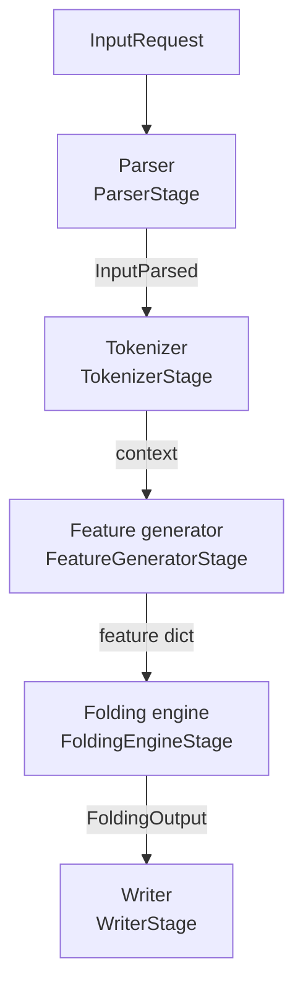

# Port a Data Pipeline

BioNeMo Inference Runtime (BioIR) runs a model end to end, from an
`InputRequest` to a written structure, only when it can turn the request into
the features the model expects. That conversion is the model's *data
pipeline*. This guide ports the data pipeline of an open-source model into
BioIR and registers it, so `build_processor` can run the model.

Port a data pipeline when BioIR already has the network for your model, or
when you are building it, and you want the full pipeline. The full pipeline
covers parsing, featurization, inference, and PDB or mmCIF output, run
serially or across GPUs with Ray. If you only need BioIR's optimized layers
inside your own model, [Accelerate a Custom Model][custom-model] is shorter.

When you finish, you have the following:

- A package at `bionemo_ir/pipeline/models/<model>/` that reproduces the
  upstream featurization.
- Registry entries that connect a model name to that package, the model
  class, and a postprocessor.
- A model that runs through `build_processor`, ready for
  [validation][validate].

Porting a pipeline is contributor work: the code lands in the BioIR
repository. Set up a development checkout as described in
[Development Workflow][dev].

In this guide, the *upstream* model is the open-source model you port from,
and the *upstream pipeline* is its code.

[custom-model]: accelerate-custom-model.md
[dev]: ../dev.md
[validate]: validate-data-pipeline.md

## How the Data Path Works

Every request passes through five stages. All models share the parser and
the writer. Your pipeline supplies the model-specific parts of the tokenizer,
feature, and engine stages. The following diagram shows the stages and what
passes between them:



Each stage does the following:

- **Parser.** Reads sequences, multiple sequence alignments (MSAs), and
  template files into an `InputParsed`. You do not write this stage.
- **Tokenizer.** Runs your context generators on the parsed input, merges
  their outputs, and applies your transforms.
- **Feature generator.** Seeds the random state, runs your feature
  generators, merges each result into the batch, and applies your collators.
- **Engine.** Runs the model's `forward`, then your postprocessor, which
  returns a `FoldingOutput`.
- **Writer.** Writes PDB or mmCIF from the `FoldingOutput`. You do not write
  this stage.

For the stage internals, refer to [the end-to-end folding
pipeline][pipeline].

You build the pipeline from five kinds of classes, all in
`bionemo_ir.pipeline.base`. Their call signatures differ in what they
receive and what they return:

| Base Class             | Called As                      | Returns                          |
| ---------------------- | ------------------------------ | -------------------------------- |
| `ContextGeneratorBase` | `generator(parsed=...)`        | the initial context              |
| `TransformBase`        | `transform(batch)`             | the same dict, modified in place |
| `FeatureGeneratorBase` | `generator(batch, context)`    | a new dict with only new keys    |
| `FeatureCollatorBase`  | `collator(features, context)`  | the same dict, modified in place |
| `PostProcessorBase`    | `postprocessor(batch, output)` | a `FoldingOutput`                |

Two declarative classes list the pieces in execution order.
`TokenizerBase` holds `context_generator_specs`, `context_merger_func`, and
`transform_specs`. `FeatureFactoryBase` holds `pre_init`,
`feature_generator_specs`, `features_merger_func`, and
`feature_collator_specs`. Each spec names a class and its constructor
arguments. `build_processor` constructs every class with the model's
pretrained config as `config` and passes `metadata` to context generators,
feature generators, and collators.

[pipeline]: ../ref/architecture.md#workflow-1-the-end-to-end-folding-pipeline

### Two Pipeline Shapes

BioIR's pipelines follow one of two shapes. Pick the one that matches how
the upstream pipeline passes data between steps.

**Flat tensors.** The context generator returns a complete dict of tensors,
and every later step works on tensors. OpenFold2 uses this shape. It fits an
upstream pipeline that builds all raw features in one pass, such as a single
`data_pipeline.process()`, and then transforms arrays.

**Context row.** The context generator returns a row that mixes tensors with
Python objects: parsed structures, RDKit molecules, per-chain MSAs, and token
tables. Feature generators read the row from `context["_row"]` and produce
tensors one concern at a time — tokens, atoms, MSA, templates — and a final
collator assembles the batch. Boltz-1, Boltz-2, and OpenFold3 use this shape.
It fits an upstream pipeline that passes non-array state between
featurization steps.

If anything other than arrays crosses the boundary between two upstream
featurization steps, use a context row.

## Before You Begin

Have the following ready before you start:

- **The upstream code.** Check out the exact version that produced your
  checkpoint. Treat it as a read-only reference.
- **The BioIR model class.** The pipeline feeds an `nn.Module` under
  `bionemo_ir/models/<family>/`. The engine builds and calls it through a
  fixed contract:
  - `get_pretrained_config(model_name)` returns a `BaseConfig` subclass
    instance. The engine rejects any other config type and reads
    `max_batch_size` from it.
  - The constructor accepts the keyword arguments `config` and
    `model_name` and loads the checkpoint through `bionemo_ir.hubs`.
  - `forward(batch, **runtime_args)` receives the feature dict on the
    device, the runtime arguments from
    [Register the Model](#register-the-model), and `sampling_seed` when
    [`pre_init`](#seeds-and-the-pre-init-hook) sets one.

  BioIR's own models show the pattern in
  [Model Constructor and `forward`][api-model]. Building the network from
  BioIR layers follows the same patterns as
  [Accelerate a Custom Model][custom-model].
- **Sample inputs with ground truth.** `examples/data/samples/` has
  monomer, homo-oligomer, hetero-oligomer, RNA, DNA, and ligand-complex
  samples, template inputs, and ground-truth structures under `gt/`.
- **A GPU that runs both models.** Validation runs the upstream model and
  BioIR on the same inputs.

[api-model]: ../ref/api.md#model-constructor-and-forward

## Inventory the Upstream Pipeline

Start from the upstream inference script — typically `run_*.py`,
`predict.py`, or `infer.py` — not from its dataset classes. The script shows
what runs at inference: how it parses input, which pipeline it calls, which
config flags matter, and how it post-processes outputs. Trace its call chain
to the featurization code, which typically lives in files such as the
following:

- `data_pipeline.py`, `pipeline.py`, or `dataset.py` — raw input to arrays
- `feature_pipeline.py` or `input_pipeline.py` — array transforms and
  ensembling
- `data_transforms.py` or `featurizer.py` — individual transforms
- `residue_constants.py` or `const.py` — vocabularies and tables
- `output.py` or `confidence.py` — output processing

List every function on the inference path in execution order, and answer
four questions for each one:

1. What does it compute?
2. Which BioIR class kind does it become? Use the placement rules that
   follow.
3. Does it run only when a config flag is set? If so, it needs
   `is_enabled()`.
4. Does it take factory arguments, such as a curried or partially applied
   function? If so, those become constructor arguments on its spec.

Place each function by what it does:

- **Builds raw features** from sequences, MSAs, templates, or structures:
  context generator, in `feature_context.py`.
- **Runs once and modifies existing keys**, such as casts, squeezes, and
  reorders: transform, in `transforms.py`.
- **Runs once and adds new keys**, such as masks, profiles, and atom maps:
  feature generator, in `feature_generators.py`.
- **Runs once per recycling iteration or ensemble member**, random or not,
  such as MSA sampling, masking, clustering, cropping, and padding:
  collator, in `feature_collators.py`.
- **Turns model outputs into coordinates and confidences**: postprocessor,
  in `postprocessor.py`.

Placement decides behavior. A per-iteration function placed among the
generators runs once instead of once per iteration, and the features change
without an error.

A condensed excerpt of the OpenFold2 inventory shows the pattern:

- `cast_to_64bit_ints` became the transform `CastTo64BitInts`.
- `randomly_replace_msa_with_unknown(0.0)` became the transform
  `RandomlyReplaceMsaWithUnknown`, and the curried `0.0` became its
  `replace_proportion` argument.
- `make_seq_mask` became the feature generator `MakeSequenceMask`.
- `make_template_mask` became the feature generator `MakeTemplateMask`,
  whose `is_enabled()` returns `config.enable_template`.
- `sample_msa(max_seq, keep_extra, seed)` became the collator `SampleMsa`.
  It reads `max_seq` from `config.max_msa_clusters`. When
  `config.resample_msa_in_recycling` is false, it seeds its own generator
  from `context["ensemble_seed"]`, so every recycling iteration draws the
  same sample. Otherwise, it draws from the global generator that `pre_init`
  seeded.
- The upstream loop that maps `ensembled_transform_fns()` over recycling
  iterations became `SampleRepeater`, which wraps the ensembled collators.

Also note every reference file the upstream code loads at startup, such as
chemical component dictionaries, per-component molecule files, and atom
tables. [Load Reference Data](#load-reference-data) covers loading them.

## Pick a Reference Pipeline

Read the existing pipelines under `bionemo_ir/pipeline/models/`, and use the
closest one as your structural template:

- `openfold2/` — flat tensors. Residue-level protein features, MSA pairing,
  templates, and `SampleRepeater` for recycling. Monomer and multimer
  variants use separate tokenizer and feature factory classes.
- `boltz2/` — context row. Token-level all-atom features for protein, RNA,
  DNA, and ligands, with RDKit molecules, templates, and constraints.
  `structure.py` and `tokenizer_logic.py` hold its structure and
  tokenization helpers.
- `boltz1/` — context row. Reuses Boltz-2's context generator and
  postprocessor with Boltz-1 feature generators.
- `openfold3/` — context row. All-atom features with conformer generation,
  MSAs, and mmCIF templates.

Prefer the same model family first, then the same pipeline shape, input
types, and feature granularity (residue-level or atom-level). If an existing
pipeline nearly fits, extend it rather than copying it.

## Lay Out the Package

Create the package with the following layout:

```text
bionemo_ir/pipeline/models/<model>/
├── __init__.py
├── const.py               # vocabularies and lookup tables
├── common.py              # math helpers shared across files
├── feature_context.py     # context generators
├── transforms.py          # tokenizer-stage transforms
├── tokenizer.py           # Tokenizer spec
├── feature_generators.py  # feature generators
├── feature_collators.py   # collators
├── feature_factory.py     # FeatureFactory spec and pre_init
└── postprocessor.py       # PostProcessor that returns FoldingOutput
```

Add helper modules as the model needs them. Existing pipelines use
`structure.py`, `tokenizer_logic.py`, `msa_pairing.py`, and
`template_logic.py`.

A port is a reimplementation, not a wrapper. The following rules keep it
one:

- **Do not import upstream code.** The pipeline must run where the upstream
  package is not installed. Do not wrap upstream functions in BioIR classes
  or paste upstream code under new names. Read it to understand the algorithm
  and data flow, then write it in BioIR's structure.
- **Copy data, not code.** Vocabularies, atom tables, and lookup arrays are
  data. Copy their values into `const.py`. Loading upstream data files with
  standard libraries is fine.
- **Port the inference path only.** Leave out training-only branches,
  compatibility shims, and dead experiments.
- **Split tangled functions.** Give each class one responsibility and a name
  that describes it. An upstream function that samples, masks, and clusters
  an MSA becomes three collators.
- **Replace constants with config.** A value hard-coded upstream, such as a
  maximum MSA depth, becomes a field on the model config.
- **Use existing dependencies.** Prefer libraries BioIR already depends on,
  such as NumPy, PyTorch, RDKit, and Biotite. Propose a new dependency only
  when none substitutes. When a result depends on a specific tool, such as
  the upstream sequence aligner, match the tool.

If you find a bug in the upstream code, implement the correct behavior, note
it where you diverge, and report it upstream:

```python
# NOTE: upstream bug at <file>:<line> — <description>.
# This implements the correct behavior.
```

Record the divergence so that validation expects it.

## Build the Tokenizer Stage

### Context Generator

The context generator turns the parsed request into the initial context.
`build_processor` constructs it with `config` and `metadata`. The stage
calls it with one keyword argument per name in its spec's
`required_kwargs`, each taken from the row, so the parameter names must
match. `parsed` is the parser output, as in the following context generator:

```python
from typing import Any

from bionemo_ir.pipeline.base import ContextGeneratorBase


class MyModelContextGenerator(ContextGeneratorBase):
    def __call__(self, parsed: dict[str, Any]) -> dict[str, Any]:
        row: dict[str, Any] = {}
        # Flat tensors: build the raw arrays and return them as tensors.
        # Context row: build structures, tokens, molecules, and MSAs; store
        # tensors and Python objects side by side for the feature generators.
        return row
```

`parsed` arrives as a plain `dict` with the fields of `InputParsed` from
`bionemo_ir.data.schemas`: `input_id` and `polymers`. Each polymer is a
`dict` too, with `polymer_type` (`protein`, `rna`, `dna`, `ccd_ligand`, or
`smiles_ligand`), `chain_id`, `sequence`, parsed `msas` and `paired_msas`,
and `templates`. Read the fields by key.

### Transforms

Transforms modify the context in place and return it. OpenFold2's first
transform casts 32-bit integer tensors to 64 bits:

```python
import torch

from bionemo_ir.pipeline.base import TransformBase


class CastTo64BitInts(TransformBase):
    def __call__(self, batch: dict[str, torch.Tensor]) -> dict[str, torch.Tensor]:
        for key, value in batch.items():
            if value.dtype == torch.int32:
                batch[key] = value.type(torch.int64)
        return batch
```

BioIR's three context-row pipelines declare no transforms. Their feature
generators do that work.

### Tokenizer Spec

A `Tokenizer` class lists the context generators, their merger, and the
transforms:

```python
from collections import OrderedDict
from collections.abc import Callable

from bionemo_ir.pipeline.base import ContextGeneratorSpec, TokenizerBase, TransformSpec, dict_context_merger


class Tokenizer(TokenizerBase):
    context_generator_specs: OrderedDict[str, ContextGeneratorSpec] = OrderedDict(
        {
            "primary": ContextGeneratorSpec(
                name="primary",
                generator=MyModelContextGenerator,
                required_kwargs=["parsed"],
            )
        }
    )
    context_merger_func: Callable = dict_context_merger
    transform_specs: list[TransformSpec] = [
        TransformSpec(name="cast_to_64_bit_ints", transform=CastTo64BitInts),
    ]
```

List transforms in upstream execution order.

## Build the Feature Stage

### Feature Generators

A feature generator returns a new dict that holds only the keys it creates.
The stage merges that dict into the batch, so each generator sees the outputs
of every generator before it. The following generator adds a sequence mask:

```python
from typing import Any

import torch

from bionemo_ir.pipeline.base import FeatureGeneratorBase


class MakeSequenceMask(FeatureGeneratorBase):
    def __call__(self, batch: dict[str, torch.Tensor], context: dict[str, Any]) -> dict[str, torch.Tensor]:
        aatype = batch["aatype"]
        return {"seq_mask": torch.ones(aatype.shape, dtype=torch.float32, device=aatype.device)}
```

In a context-row pipeline, read Python objects from the row:

```python
class TokenFeatureGenerator(FeatureGeneratorBase):
    def __call__(self, batch, context):
        row = context["_row"]  # everything the context generator returned
        return {"res_type": torch.as_tensor(row["tokens"]["res_type"])}
```

Here `row["tokens"]` stands for whatever your context generator stored. The
stage passes tensors and numeric arrays in `batch`, and `context["_row"]`
holds the whole row, including non-array objects.

Gate optional steps with `is_enabled()` and keep the spec in the list, so
the declared pipeline has the same shape for every request:

```python
class MakeTemplateMask(FeatureGeneratorBase):
    def is_enabled(self) -> bool:
        return self.config.enable_template

    def __call__(self, batch, context):
        aatype = batch["template_aatype"]
        return {"template_mask": torch.ones(aatype.shape[0], dtype=torch.float32, device=aatype.device)}
```

Accept constructor arguments by keyword and pass `**kwargs` to the base
class, because `build_processor` also passes `metadata`:

```python
class Atom37ToTorsionAngles(FeatureGeneratorBase):
    def __init__(self, config=None, prefix: str = "", **kwargs):
        super().__init__(config, **kwargs)
        self.prefix = prefix
```

The stage enforces or assumes the following rules:

- Give every generator a unique name. The stage checks names only at run
  time and only among enabled generators, where a repeat raises
  `ValueError`. A duplicate on a disabled generator goes unnoticed.
- Merging uses `dict.update`, so a generator key that already exists in the
  batch replaces the old value without warning. Choose new key names.
- Create tensors on the batch's device (`device=batch["aatype"].device`),
  never on a hard-coded one.
- Every `self.config.<field>` must exist on the model config, or the stage
  fails with `AttributeError` at run time.

### Collators

A collator modifies the feature dict in place and returns it. Collators do
the per-iteration work: sampling, masking, clustering, cropping, padding, and
final assembly. Draw randomness only from state that `pre_init` seeded, so
one request seed reproduces the same features. Use a `torch.Generator` built
from a seed on `context`, or the global generators that `pre_init` seeds, as
in the following collator:

```python
from bionemo_ir.pipeline.base import FeatureCollatorBase


class SampleMsa(FeatureCollatorBase):
    def __init__(self, config=None, keep_extra: bool = True, **kwargs):
        super().__init__(config, **kwargs)
        self.keep_extra = keep_extra

    def __call__(self, features, context):
        generator = torch.Generator(device=features["msa"].device)
        generator.manual_seed(context["ensemble_seed"])
        # Keep the query row first, then shuffle the rest with this generator.
        ...
        return features
```

The complete version is `SampleMsa` in
`bionemo_ir/pipeline/models/openfold2/feature_collators.py`.

### Recycling and Ensembles

When the upstream code runs a set of transforms once per recycling iteration
and stacks the results, wrap those collators in `SampleRepeater` instead of
writing the loop yourself:

```python
from bionemo_ir.pipeline.base import FeatureCollatorSpec
from bionemo_ir.pipeline.models.openfold2.feature_factory import SampleRepeater

FeatureCollatorSpec(
    name="repeater",
    functor=SampleRepeater,
    kwargs={
        "feature_collator_specs": [
            FeatureCollatorSpec(name="sample_msa", functor=SampleMsa),
            # ...the other per-iteration collators, in upstream order.
        ],
        "get_n_iters": lambda config: config.max_recycling_iters + 1,
    },
)
```

`SampleRepeater` runs the inner collators once per iteration and stacks
every key along the last axis (`stack_dim=-1`). Two details shape how you
write those collators:

- Each iteration starts from a shallow copy of the batch. Assign new
  tensors to keys, and never modify a tensor in place, for example with
  `add_` or an indexed assignment. An in-place change carries into every
  iteration and into the caller's batch.
- `SampleRepeater` constructs its inner collators with `config` and their
  spec's `kwargs` only. They receive no `metadata`.

### Seeds and the Pre-Init Hook

`pre_init` runs before the context generators in the tokenizer stage and
before the feature generators in the feature stage. Both stages call it as
`pre_init(context=context)`, and the feature stage continues with the return
value, so always return the context. It takes the request's `random_seed`
from the input row or from the stage's `init_context`, seeds the random
number generators, and places derived seeds on `context`. The following code
example is OpenFold2's `pre_init`:

```python
import random

import numpy as np
import torch


def pre_init(context):
    random_seed = context.get("random_seed", 0)
    if random_seed is None:
        random_seed = random.SystemRandom().randrange(2**32)
    np.random.seed(random_seed)
    torch.manual_seed(random_seed + 1)
    context["ensemble_seed"] = random.Random(random_seed).randint(0, torch.iinfo(torch.int32).max)
    return context
```

Derive every random draw from these seeds. Reproducible features are what
make [feature equivalence][validate] testable, and the seed flow is fragile:
one extra random call shifts every draw after it.

When the model itself samples, as a diffusion model does, also set
`context["sampling_seed"]` in `pre_init`. The engine passes it to `forward`
as the `sampling_seed` keyword argument, unless the runtime arguments
already set one. Boltz-2's `pre_init` does this.

### Feature Factory Spec

A `FeatureFactory` class lists `pre_init`, the feature generators, their
merger, and the collators:

```python
from collections.abc import Callable

from bionemo_ir.pipeline.base import (
    FeatureCollatorSpec,
    FeatureFactoryBase,
    FeatureGeneratorSpec,
    default_context_and_feature_merger,
)


class FeatureFactory(FeatureFactoryBase):
    pre_init: Callable = pre_init
    feature_generator_specs: list[FeatureGeneratorSpec] = [
        FeatureGeneratorSpec(name="make_sequence_mask", functor=MakeSequenceMask, kwargs={}),
        FeatureGeneratorSpec(name="make_template_mask", functor=MakeTemplateMask, kwargs={}),
    ]
    features_merger_func: Callable = default_context_and_feature_merger
    feature_collator_specs: list[FeatureCollatorSpec] = [
        # SampleRepeater, final selection, padding, ...
    ]
```

List generators and collators in upstream execution order.

### Load Reference Data

All-atom and ligand-capable models need reference data beyond the request:
a chemical component dictionary (CCD), per-component RDKit molecules, and
atom tables. From this data they build reference-conformer features such as
ideal atom positions, elements, charges, atom-name encodings, and atoms per
token. Load that data as follows:

- Load the same files the upstream code loads, with standard libraries such
  as `pickle`, `json`, NumPy, and RDKit. You reimplement only the loading
  code, and you can share the data files.
- Keep small fixed tables in `const.py`.
- Receive file locations through `metadata`, a dict such as
  `{"ccd_path": ..., "mol_dir": ...}`. `build_processor` resolves it with
  `load_metadata(model_name)` from `bionemo_ir/hubs/metadata.py`, and users
  can override it with `EngineProcessorConfig(metadata=...)` or
  `metadata_loader=...`.
- Load the files once, in `__init__` or on first use, not on every call.

## Write the Postprocessor

The postprocessor turns the model's raw output into one `FoldingOutput` per
request, with NumPy arrays:

- Required: `atom_positions` (residues × atom types × 3, in ångströms),
  `residue_types`, `atom_mask`, and `residue_indices`.
- Optional: `b_factors`, `chain_indices`, `plddt`, `ptm`, `iptm`, `pae`,
  `max_pae`, `residue_names`, and `mol_types`.

If the model returns several samples, such as several diffusion samples,
select one inside the postprocessor with the upstream selection rule, such
as the highest confidence. Downstream stages expect exactly one structure
per request. The following postprocessor shows the structure:

```python
from typing import Any

from pydantic import BaseModel

from bionemo_ir.data.schemas import FoldingOutput
from bionemo_ir.pipeline.base import PostProcessorBase


class PostProcessorConfig(BaseModel):
    pass


class PostProcessor(PostProcessorBase):
    def __init__(self, config: BaseModel | None = None, **kwargs: Any):
        super().__init__(config or PostProcessorConfig(), **kwargs)

    def __call__(self, batch: dict[str, Any], output: dict[str, Any]) -> FoldingOutput:
        # 1. Pick one sample by the upstream rule.
        # 2. Compute confidences: pLDDT, pTM, ipTM, PAE.
        # 3. Map coordinates and masks onto BioIR's atom layout.
        # 4. Convert tensors to NumPy.
        return FoldingOutput(
            atom_positions=...,
            residue_types=...,
            atom_mask=...,
            residue_indices=...,
            chain_indices=...,
            plddt=...,
        )
```

The engine constructs the postprocessor with its own postprocessor config,
which is `None` unless the user sets one, so fall back to a default as the
example does.

Write structures only with BioIR's writers. If a written structure looks
wrong, fix the postprocessor or the shared `PDBWriter` and `CIFWriter` in
`bionemo_ir.data.writers`. Do not add a model-specific writer. Two fields
decide what the writers emit:

- `residue_types` indexes the model's residue vocabulary, which
  `get_all_residue_types(model_name)` in `bionemo_ir/data/utils.py` returns.
  Your model needs a branch there, in the exact index order the model emits.
  A wrong order writes wrong residue names — for example, swapped RNA `C`
  and `G` — and quietly breaks scoring. The function matches model names by
  substring, such as `"boltz" in model`, so a name like `boltz-3` silently
  gets Boltz's vocabulary. Add your branch as an exact-name match ahead of
  the existing branches.
- `residue_names` and `mol_types` let the mmCIF writer classify ligands and
  nucleic acids explicitly instead of guessing from residue letters.

## Register the Model

Registration connects a model name to your pipeline in four steps:

1. Add the model name to `FoldingSupportMatrix` in
   `bionemo_ir/hubs/support_matrix.py`.
2. Make the checkpoint resolvable. Add an entry that names the
   `<MODEL>_CKPT` environment variable to `LOCAL_CHECKPOINTS` in
   `bionemo_ir/hubs/local.py`. For a Hugging Face download, also add one to
   `HF_CHECKPOINTS` in `bionemo_ir/hubs/hf.py`.
   `bionemo_ir.hubs.load_weights` tries the local entry first, so a name
   missing from `LOCAL_CHECKPOINTS` fails with `KeyError`. If the model needs
   reference data, register its metadata files in
   `bionemo_ir/hubs/metadata.py`. Refer to [Model Weights][weights].
3. Add the residue vocabulary branch to `get_all_residue_types` in
   `bionemo_ir/data/utils.py`, as described in
   [Write the Postprocessor](#write-the-postprocessor).
4. Add a factory to `bionemo_ir/registry.py` and append it to the list in
   `register_all_factories()`:

```python
class MyModelFactory(ModelComponentsFactory):
    @classmethod
    def get_default_runtime_args(cls) -> dict[str, Any]:
        return {"recycling_steps": 3, "num_sampling_steps": 200, "diffusion_samples": 1}

    @classmethod
    def get_model_class(cls) -> type[nn.Module]:
        from bionemo_ir.models.mymodel import MyModel

        return MyModel

    @classmethod
    def get_tokenizer(cls) -> "TokenizerBase":
        from bionemo_ir.pipeline.models.mymodel.tokenizer import Tokenizer

        return Tokenizer()

    @classmethod
    def get_feature_factory(cls) -> "FeatureFactoryBase":
        from bionemo_ir.pipeline.models.mymodel.feature_factory import FeatureFactory

        return FeatureFactory()

    @classmethod
    def get_postprocessor(cls) -> type["PostProcessorBase"]:
        from bionemo_ir.pipeline.models.mymodel.postprocessor import PostProcessor

        return PostProcessor

    @classmethod
    def get_supported_model_names(cls) -> list[str]:
        return [SupMat.MyModel]
```

Import inside the methods, as the existing factories do. Registration runs
when Python imports `bionemo_ir`, and deferred imports keep that import fast.
`get_default_runtime_args` returns the keyword arguments the engine passes
to the model's `forward`. Users override them with
`EngineProcessorConfig(runtime_args=...)`.

Confirm that the registry resolves the new name:

```bash
uv run --locked python -c "
from bionemo_ir.registry import get_feature_factory, get_tokenizer
print(type(get_tokenizer('my-model')).__name__, type(get_feature_factory('my-model')).__name__)
"
```

[weights]: ../ref/model-weights.md

## Run the Model End to End

The folding demo accepts any registered model. Run it on a bundled sample:

```bash
uv run --locked python examples/folding/run_demo.py \
    --model-source my-model \
    --input examples/data/samples/monomers/T1031.json \
    --output-dir output
```

The demo writes `output/T1031.cif` and `output/T1031_scores.json`. It
passes `--recycling-steps`, `--sampling-steps`, and `--diffusion-samples`
only for the names in its `DIFFUSION_MODELS` set. Any other model runs with
its factory's default runtime arguments. If your model takes those
arguments, add its name to that set.

A clean run shows that the pieces connect. It does not show that the
features are right. Continue with
[Validate a Ported Data Pipeline][validate].

## Pitfalls

### Features Computed With RDKit

Pipelines that handle ligands or nonstandard residues compute features from
RDKit molecules: distance bounds, chirality, stereochemistry, planarity,
charges, and conformers. Bugs in these features share one symptom. The
feature tensor comes out empty or wrong, it can match an equally empty
upstream reference, and nothing fails until prediction quality drops. Watch
for the following causes:

- **Editing a molecule can drop computed properties.** Calls such as
  `RemoveHs(sanitize=False)`, atom removal, or a SMILES round trip can
  strip properties such as `_CIPRank`, hybridization, and ring information.
  After each edit, rerun the perception you depend on, such as
  `AssignStereochemistry` or `SanitizeMol`, and assert that the property is
  present.
- **Loaded molecules can lack perception.** Molecules from pickles, mmCIF,
  or vendor files can arrive without aromaticity, ring information, or
  stereochemistry, so SMARTS patterns match nothing. Either match upstream
  exactly by making the same perception calls it makes, or add perception
  and reconcile with upstream. Never add it on one side only.
- **Preparation order matters.** Ring perception must precede
  `GetMoleculeBoundsMatrix`, stereochemistry assignment must precede chiral
  lookups, and embedding must precede reading a conformer. Replicate the
  upstream order.
- **Failures must raise.** `EmbedMolecule` returns a status code instead of
  raising, sanitization can partly fail, and `MolFromSmarts` returns `None`
  for an invalid pattern. Check each result and raise a clear error.
- **Atom order is part of the result.** Index tensors depend on iteration
  order. Enumerate atoms and bonds the way upstream does, with the same
  hydrogen handling, and shift each molecule's local atom indices by its
  global atom offset.

Build each index tensor and its companion flag or bound arrays from the same
list of items, so their order cannot drift apart. Compile SMARTS patterns
once at module load. [Validation][validate] must include inputs where each of
these features has to be non-empty.

### Templates

Protein templates are a supported input: the request schema's `Template`,
for protein chains only. When the upstream model consumes templates, port
the real featurization rather than a stub. Inference uses the path where the
user supplies a template mmCIF file. For each protein chain, parse the
template, select a chain, align it to the query, map query positions to
template residues, extract backbone atoms, and compute the `template_*`
features. `bionemo_ir/pipeline/models/openfold3/template_logic.py` is a
complete implementation. Each of the following details caused a real
divergence in that port:

- **The no-template path must match upstream exactly.** Upstream typically
  emits all-zero masks and the gap residue class when no template is given,
  not masks of ones. A wrong empty path silently degrades every prediction
  without templates, so verify it first.
- **Use the upstream aligner.** A different aligner produces different
  alignments.
- **Use the upstream alternate-location policy.** Biotite defaults to the
  first conformer, and upstream code can choose the highest occupancy
  instead.
  Masks agree either way, but distances do not.
- **Align against the same sequence.** Upstream can align against the
  entity's canonical sequence, which maps modified residues to their parent
  amino acid, rather than a residue-by-residue mapping that emits `X`.
- **Port the chain selection and keep-or-drop rules as written.** When no
  chain is given, upstream picks the best-aligned chain by its own rule. Its
  coverage rule can differ for templates with modified residues. Replicate
  it rather than approximating it.
- **Unresolved residues keep their residue type.** Their coordinates are
  missing and masked, but they are not the gap class.
- **Make selection deterministic at inference.** Upstream inference can use
  deterministic top-k selection where the training default is random.

### Input Coverage

The request schema supports the following inputs:

- Protein monomers and multimers, with MSAs, paired MSAs, and templates
- RNA and DNA
- Ligands by CCD code, one or several joined with underscores, such as
  `ATP_FAD`
- Ligands by SMILES string

Port every input type that the upstream model supports. If you leave one
out on purpose, document the limitation with example inputs.

The schema does not represent covalent bonds between entities, per-residue
modifications, SDF or MOL ligand files, user-supplied CCD entries, or glycan
semantics beyond a multi-component CCD ligand.

## Related

- [Validate a Ported Data Pipeline][validate] — prove the port matches
  upstream.
- [Architecture: The Two Trees a Model Family Occupies][two-trees] — how
  the data path and the compute path divide the work.
- [Python API][api] — `build_processor` and its configuration.

[api]: ../ref/api.md
[two-trees]: ../ref/architecture.md#the-two-trees-a-model-family-occupies
