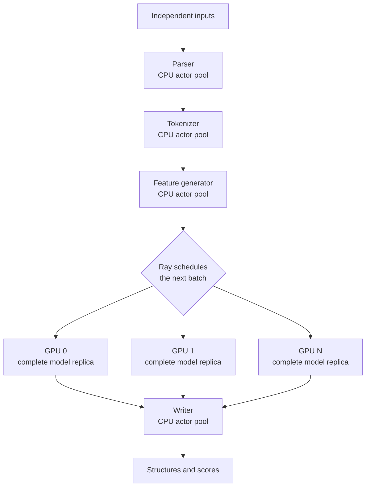

## About BioNeMo Inference Runtime

NVIDIA BioNeMo Inference Runtime (BioIR) is NVIDIA's Python library for
accelerating biomolecular structure model inference on NVIDIA GPUs. It
provides biology-aware PyTorch modules, GPU kernels, and graph optimizations
for architecture-specific operations. These operations include Evoformer
stacks and triangle operations [^alphafold2], and Pairformer stacks,
attention with pair bias (pairwise attention), diffusion transformers, and
atom-level modules [^alphafold3].

General-purpose inference stacks do not fully optimize these specialized
operations. BioIR is designed for foundation-model developers and machine
learning researchers who create or modify biomolecular architectures. It
improves model-execution throughput and reduces GPU memory pressure while
preserving a Python development workflow.

The following chart shows how BioIR speedup changes with input size on an
NVIDIA H100 GPU.

## Key Capabilities

BioIR provides the following key capabilities:

- **Architected on PyTorch:** A BioIR model remains an ordinary
  `torch.nn.Module`. No engine build, export step, or separate build artifact
  sits between a checkpoint and a forward pass. You can inspect tensors and use
  standard Python stack traces. Plain configuration fields select optimized
  layers, with documented PyTorch fallbacks for supported paths.

- **Built for biomolecular architectures:** BioIR applies optimizations at three
  levels: kernels, modules and layers, and the end-to-end pipeline. Custom
  CuTeDSL kernels and CUDA graphs use NVIDIA GPU capabilities to accelerate
  structure-prediction patterns and supported modules. Pipeline orchestration
  overlaps data loading, featurization, and output writing with the GPU forward
  pass. Refer to
  [how BioIR accelerates](../../ref/architecture.md#how-bioir-accelerates).

- **Lower GPU memory pressure:** Fused kernels reduce intermediate
  materialization. Output-row chunking bounds peak activations for `O(N^2)` pair
  tensors. Precomputed masks avoid rebuilding the same attention data in every
  layer. Refer to
  [where the memory savings come from](../../ref/architecture.md#where-the-memory-savings-come-from).

- **Supported hardware and models:** BioIR supports mixed FP32 and BF16
  execution across data center and workstation GPUs. Six are qualified for this
  release; the rest of the matrix runs but is not part of that set. The
  [support matrix](../../ref/support-matrix.md) lists model keys, input
  coverage, GPU architectures, and fused-kernel availability.

## Choose How to Use BioIR

BioIR supports two inference workflows:

1. **Run a supported model end to end.** Run OpenFold2, AlphaFold2, OpenFold3,
   Boltz-1, or Boltz-2 through the complete prediction pipeline.
2. **Accelerate a custom model.** Keep your architecture and replace matching
   components with optimized BioIR modules, such as a Pairformer stack or
   diffusion transformer [^alphafold3].

Your custom model does not need to belong to a supported end-to-end family. It
only needs to contain a module that BioIR optimizes. Refer to
[the two inference workflows](../../ref/architecture.md#two-inference-workflows)
for implementation details.

### Choose an Executor

For large batches of independent inputs, use the Ray executor to improve
end-to-end throughput. Ray streams inputs through independently scalable
preprocessing, GPU inference, and output-writing stages, so CPU work on one
batch can run while GPUs process another. The inference stage assigns one
complete model replica to each GPU, which lets available GPUs process
different inputs concurrently.

<Warning>
Ray does not split one prediction across multiple GPUs or
reduce its individual latency. Use the serial executor for debugging and
per-request timing.
</Warning>

Refer to
[Ray multi-GPU replicas](../../ref/api.md#ray-multi-gpu-replicas) for
configuration details.

The following diagram shows how the Ray executor processes independent
inputs across CPU stages and complete GPU model replicas.

## Target Workloads

BioIR targets large-scale structure inference workloads.

- **High-throughput protein design** — generate and evaluate large candidate
  sets with hybrid generative and folding models.
- **Synthetic data generation** — produce structures in bulk for
  self-distillation, retraining, and fine-tuning.
- **Folding-based scoring filters** — screen and rank generative output by
  structural plausibility before committing to wet-lab work.
- **Structure prediction alongside docking** — supplement early-stage
  protein-ligand and protein-protein screening with structure predictions.

BioIR accelerates the GPU model-execution layer. It does not accelerate database
search, MSA generation, experimental data preparation, or the remaining
design-to-lab workflow. End-to-end gains still depend on how much time remains
in the model forward pass after preprocess.

Related proteome-scale structure prediction work is described in:

- [How to Accelerate Protein Structure Prediction at Proteome
  Scale][accel-structure-prediction]
- [AlphaFold Database expands to proteome-scale quaternary structures][afdb].

[accel-structure-prediction]: https://developer.nvidia.com/blog/how-to-accelerate-protein-structure-prediction-at-proteome-scale/
[afdb]: https://research.nvidia.com/labs/dbr/assets/data/manuscripts/afdb.pdf
[alphafold2-paper]: https://doi.org/10.1038/s41586-021-03819-2
[alphafold3-paper]: https://doi.org/10.1038/s41586-024-07487-w

[^alphafold2]: Jumper et al., ["Highly accurate protein structure prediction
    with AlphaFold"][alphafold2-paper], *Nature* 596, 583–589 (2021).
[^alphafold3]: Abramson et al., ["Accurate structure prediction of biomolecular
    interactions with AlphaFold 3"][alphafold3-paper], *Nature* 630, 493–500
    (2024).

## Start Here

<CardGroup cols={2}>
  <Card title="Install BioIR" icon="download" href="../../install.md">
    Install the latest release wheel for your CPU architecture.
  </Card>
  <Card title="Run a Boltz-2 prediction" icon="rocket" href="../../quickstart.md">
    Fold a protein sequence with Boltz-2 and inspect the output.
  </Card>
  <Card title="Scale predictions with Ray" icon="server" href="../../ray.md">
    Run one Boltz-2 replica per visible GPU for concurrent batch inference.
  </Card>
  <Card title="Use the Python API" icon="code" href="../../ref/api.md">
    Prepare inputs and run supported structure-prediction models.
  </Card>
  <Card
    title="Understand the architecture"
    icon="diagram-project"
    href="../../ref/architecture.md"
  >
    The two workflows, the three levels of acceleration, and how the pieces fit.
  </Card>
  <Card
    title="Review performance benchmarks"
    icon="chart-line"
    href="../../ref/benchmark.md"
  >
    Compare BioIR speed, peak memory, and accuracy with OSS PyTorch baselines.
  </Card>
</CardGroup>
