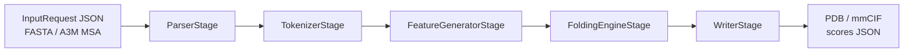
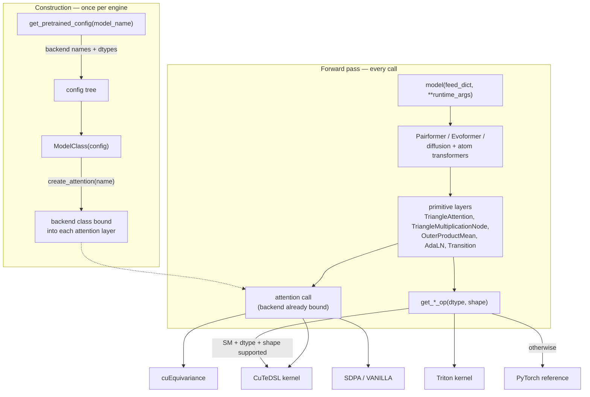
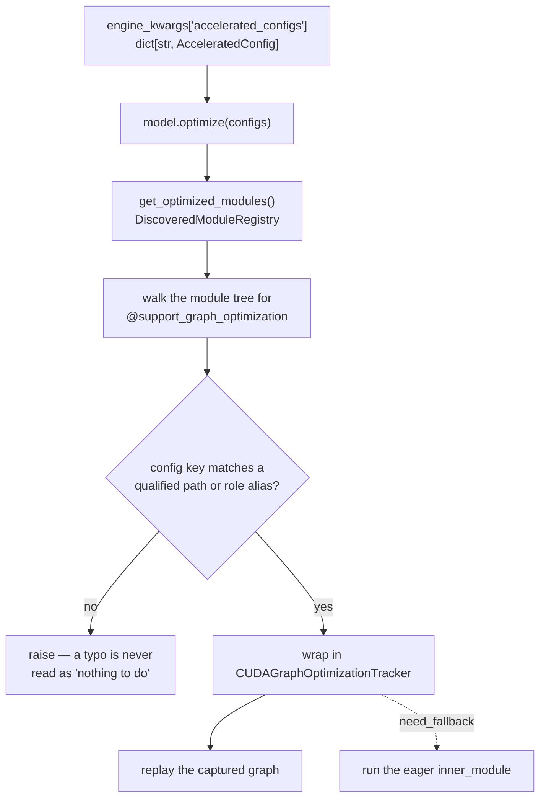

<!--
SPDX-FileCopyrightText: Copyright (c) 2026 NVIDIA CORPORATION & AFFILIATES. All rights reserved.
SPDX-License-Identifier: Apache-2.0
-->

# Architecture

How BioNeMo Inference Runtime (BioIR) is put together, from an `InputRequest`
to a PDB / mmCIF file. Which models and GPUs are supported is in the
[support matrix][support-matrix]; the calling surface is in the
[API reference][api].

Inference runs as a five-stage [Ray Data][ray-data] pipeline. The same pipeline
serves every supported model — per-model behavior comes from a factory
registry, not from branching inside the stages.

## The five-stage pipeline

| Stage                   | Turns                    | Into                    | Source                         |
| ----------------------- | ------------------------ | ----------------------- | ------------------------------ |
| `ParserStage`           | `InputRequest` + files   | parsed records          | `parser_stage.py`              |
| `TokenizerStage`        | parsed records           | token context           | `tokenizer_stage.py`           |
| `FeatureGeneratorStage` | token context            | feature dict of tensors | `feature_generator_stage.py`   |
| `FoldingEngineStage`    | feature dict             | `FoldingOutput`         | `engine_stage.py`              |
| `WriterStage`           | `FoldingOutput`          | PDB / mmCIF + scores    | `writer_stage.py`              |

**Parser.** Materializes what the request references: FASTA via
`data/parsers/fasta.py`, A3M MSAs via `data/parsers/a3m.py`.
`FileContentCache` deduplicates by MD5 content hash and by path, so a file or
inline block shared by several requests is read and stored once.

**Tokenizer.** Runs a set of context generators, merges their outputs with a
merger function, then applies optional transforms. Model-family metadata (CCD
paths, `mol_dir` for the ligand-capable models) is threaded in through stage
metadata.

**Feature generator.** Runs feature generators, merges their outputs with the
context, then applies collators to assemble the final batch tensors.

**Folding engine.** Delegates to `FoldingEngine` in `engine.py`,
which builds the `nn.Module`, moves it to the device, calls `optimize` when an
`AcceleratedConfig` dict is present, runs the forward pass under
`torch.inference_mode()`, then the postprocessor. Under Ray, replicas are
placed one per GPU (`ParallelismMode.REPLICA`), so the forward pass is the
parallelism unit.

**Writer.** Serializes each `FoldingOutput` to disk. Default format is PDB
(`pdb_writer.py`); configure `format=["pdb", "cif"]` to also emit mmCIF
(`cif_writer.py`) from the same coordinates in one pass. Scores
(pLDDT, pTM, ipTM, PAE) go in a JSON payload. `scores` and `output_paths` are
JSON-encoded **strings**, so PyArrow sees one column type across rows.

## The packed `__data__` column

Between stages, each row's payload is pickled into a single `__data__` column
instead of being spread across typed columns. Folding payloads are deeply
nested and heterogeneous — dicts of tensors, arrays, and Python objects whose
shape varies per model and per request — and handing those to Arrow forces
schema inference that is slow and error-prone. Only `__inference_error__` and
`__record_id` stay as plain top-level columns; they have uniform simple types.

The terminal writer stage sets `pack_output = False` and emits flat
Arrow-friendly columns, since its output schema is simple. Packing lives in
`pipeline/stages/base.py`; use `unpack_pipeline_row` there to read
packed rows. The same file also records per-stage wall time into
`stage_timing_s` and captures per-row exceptions into `__inference_error__`
rather than failing the batch — a bad request does not take down the run.

## Registry and factory model

Per-model components resolve through `registry.py`, not through
conditionals in the stages. Each family has a `ModelComponentsFactory` exposing
`get_model_class`, `get_tokenizer`, `get_feature_factory`,
`get_postprocessor`, `get_default_runtime_args`, and
`get_supported_model_names`. `register_all_factories` runs as an import side
effect of `import bionemo_ir`, so the registry is populated before any
stage runs.

Registered factories: `OpenFold2Factory`, `OpenFold2MultimerFactory`,
`Boltz1Factory`, `Boltz2Factory`, `Boltz2AffinityFactory`, `OpenFold3Factory`.
Boltz-1/2 and OpenFold3 default to `recycling_steps=3`,
`num_sampling_steps=200`, `diffusion_samples=1` (OpenFold3 remaps those
Boltz-style names onto its own cycle / rollout knobs). AlphaFold2 / OpenFold2
take no extra runtime args — recycle count comes from the feature axis.

Registered keys and the model-key constants are two different sets. A key can
exist in `FoldingSupportMatrix` (`hubs/support_matrix.py`) with no
usable pipeline behind it — `protenix-v2` has a compute path under
`models/protenix/` but no pipeline factory, and `Boltz2AffinityFactory` raises
`NotImplementedError` for its tokenizer, feature factory, and postprocessor. In
those cases `build_processor` raises instead of building a partial pipeline.

## Processor: Ray vs serial

`build_processor` in `engine_proc.py` takes an
`EngineProcessorConfig` and returns one of two executors, both defined in
`pipeline/processor/base.py`:

- `executor_backend="ray"` → `Processor`, the stages as a distributed Ray Data
  pipeline. This is the throughput path.
- `executor_backend=None` (default) → `SerialProcessor`, the same stage UDFs
  run in-process and sequentially. Useful for debugging and per-request timing.

The staged Ray layout exists to hide latency and scale the bottleneck: the
CPU-bound stages (parse, tokenize, featurize, write) overlap with GPU
inference, and the engine stage scales independently by adding replicas.
`EngineProcessorConfig.create_default_replica_mode_config` builds a Ray config
that places one engine per visible GPU. Per-row timings under Ray are therefore
not comparable to serial numbers — use serial to ask "what does the model
cost?" and Ray to ask "what does the system deliver?".

## The two trees a model family occupies

A family lives in two directories that answer different questions.

`bionemo_ir/pipeline/models/<model>/` is the **data path** — how a
request becomes a feature dict. It holds subclasses of the base classes in
`pipeline/base.py` (context generators, transforms, feature
generators, collators, tokenizer, feature factory, postprocessor) plus the
pydantic `*Spec` objects that declare them in order.

`bionemo_ir/models/<family>/` is the **compute path** — how features
become coordinates. It holds `modeling.py` (the top-level module, its
`load_weights`, `get_optimized_modules`, `get_pretrained_config`), `config.py`
(the config tree and `PRETRAINED_CONFIG_REGISTRY`), and `convert.py` (upstream
checkpoint names → internal ones).

Five families exist today, and the two trees do not line up one-to-one:

| `models/<family>/` | Module classes             | `pipeline/models/` | Model keys served                          |
| ------------------ | -------------------------- | ------------------ | ------------------------------------------ |
| `boltz1/`          | `Boltz1`                   | yes                | `boltz-1`                                  |
| `boltz2/`          | `Boltz2`, `Boltz2Affinity` | yes                | `boltz-2`, `boltz-2-affinity`              |
| `openfold2/`       | `OpenFold2`                | yes                | every `openfold2_*` and `alphafold2_*` key |
| `openfold3/`       | `OpenFold3`                | yes                | `openfold3`                                |
| `protenix/`        | `Protenix`                 | **no**             | `protenix-v2` (no factory registered)      |

Two asymmetries are worth knowing. `openfold2/` is one compute path behind many
keys: the AlphaFold2 and AlphaFold2-multimer keys are `OpenFold2` with a
different pretrained config, and the multimer keys additionally get their own
tokenizer and feature factory in the data path. `protenix/` is the reverse —
a compute path with no data path at all, so it has no entry in
`pipeline/models/` and no registered factory.

The split is why a data-pipeline change never touches a compute-side config,
and why the same model can be driven by a different front end.

### Conventions in the data path

Three conventions carry most of the weight, and all three exist so the declared
pipeline keeps the same shape from one request to the next:

- A generator that does not apply to a request returns `False` from
  `is_enabled()`. Specs are not conditionally dropped from the list.
- Per-request state — the random seed above all — arrives on the `context`
  dict. The feature factory's `pre_init` hook (threaded into both the tokenizer
  and feature-generator stages) runs before the generators and decides what to
  do with it.
- Repetition is a collator, not a loop in the caller. OpenFold2's
  `SampleRepeater` re-runs a sub-list of collators and stacks the results,
  which is how resampling over one context is expressed.

`TokenizerBase` and `FeatureFactoryBase` in `pipeline/base.py`
document the order these run in
(`context_generator → merger → transform` and
`pre_init → feature_generator → merger → collator`).

## Modules, adapters, and weight conversion

A model is an ordinary `nn.Module` composed from shared optimized layers, so
the runtime stays PyTorch end to end: you can step into it, print a tensor, and
read a stack trace. There is no build artifact between the checkpoint and the
forward pass.

The reusable layers live under `_torch/layers/`, composite stacks under
`_torch/layers/transformers/`, and family-specific glue under
`_torch/modules/<family>/`. Assembling a model is mostly a wiring exercise over
those — see [Transformer primitives](#transformer-primitives).

The cost of sharing them is that upstream checkpoints do not map key for key —
the optimized modules fuse projections that upstream keeps separate. Two
consequences:

- Composite modules expose their own `load_weights(weights)` instead of relying
  on `load_state_dict`. `recursive_calling_load_weights` in
  `_torch/utils.py` walks the tree depth-first and calls it where
  present.
- Converters are per component, not per model. `models/boltz1/convert.py` holds
  the shared building-block helpers (`convert_hf_*` and `get_*_weights`); the
  Boltz-2 and OpenFold3 converters import those rather than reimplementing
  them. New conversion code is needed only for a genuinely different layout.

Checkpoints themselves resolve through `hubs/`: `load_weights` tries
the local hub, then Hugging Face, unless `hub=` pins one. `hubs/metadata.py`
handles CCD/mol archives and the cache directory
(`BIOIR_CACHE`). See [model weights][model-weights].

### Transformer primitives

`_torch/layers/` is the primitive layer — attention, triangle nodes,
transitions, normalization, linear projections, outer product mean, pair
averaging, conditioning, position encoders. Nothing in it is model-specific; a
family picks the pieces it needs and wires them in `modeling.py`.

`_torch/layers/transformers/` composes those into the stacks a family assembles
from:

| Module                     | Stacks                                                                    |
| -------------------------- | ------------------------------------------------------------------------- |
| `pairformer.py`            | `PairformerModule` (V1/V2 layers), `PairformerNoSeqModule`                |
| `evoformer.py`             | `EvoformerStack`, `EvoformerBlock`                                        |
| `diffusion_transformer.py` | `DiffusionTransformerLayer` + `Boltz` / `OpenFold3` / `Protenix` variants |
| `atom.py`                  | `AtomTransformer`, `AtomAttentionEncoder`, `AtomAttentionDecoder`         |

Only `transformers/__init__.py` re-exports a public surface (`EvoformerStack`,
`PairformerModule`, the two diffusion transformers); `layers/__init__.py`
exports nothing, so primitives are imported from their module directly.

## Config propagation

Model configs (`BaseConfig`) and pipeline configs (`EngineProcessorConfig`
and the `*StageConfig` types) are two trees. How they are laid out, what
propagates, and how they meet at the engine is in
[config architecture][config].

`BaseConfig` in `configs/base.py` is a pydantic model with
`extra = "allow"`, so a family adds fields without touching the base. Shared
settings propagate **by value** down the tree, through `_recursive_set` and the
`set_*` helpers (`set_dtype`, `set_max_seq_len`, …). Reference fields — one
sub-config pointing at another's field — are not supported. That is the
assumption that most often surprises a first reader.

Class defaults are not what a run uses. The engine stage takes the model config
from `engine_kwargs["config"]` when you supply one, and otherwise calls the
model class's `get_pretrained_config(model_name)` (see
`engine_stage.py`). That method — in `modeling.py`, not
`config.py` — is where a family sets its real dtypes and per-subtree execution
settings. Read a class default as the value *before* the pretrained config
runs.

## Acceleration

There is a single supported inference path — `torch` — and no engine-build
step. The model stays an ordinary `nn.Module`; compute-heavy submodules route
to accelerated implementations chosen by config fields that
`get_pretrained_config` resolves once, subtree by subtree. Because those are
plain config fields you can override them: set them on the config after the
pretrained config is built, then pass it through `engine_kwargs["config"]`.
Which GPUs take the accelerated path is in the
[support matrix][support-matrix].

Two mechanisms deliver it, and they are selected at different moments:
**attention backends** are named in the config and resolved when a module is
constructed; **fused ops** are picked by a getter at call-setup time from the
GPU, dtype, and shape. Neither is `optimize()`.

The dotted edge is the point of the diagram: the attention backend is decided
in the left box and merely *used* on the right, while the fused-op getter
decides on every call. Both bottom out in the same set of implementations, and
both have a PyTorch path to fall back to.

### Attention backends

`_torch/attention_backend/` is a small dispatcher over two attention shapes,
`AttentionType.TRIANGLE` and `AttentionType.PAIRWISE`. Every backend computes
the same function; the choice affects speed and memory, not results.

| Name      | Triangle | Pairwise | Notes                                              |
| --------- | -------- | -------- | -------------------------------------------------- |
| `VANILLA` | yes      | yes      | pure-PyTorch reference                             |
| `SDPA`    | yes      | yes      | `torch.nn.functional.scaled_dot_product_attention` |
| `CUEQUIV` | yes      | —        | cuEquivariance, needs `cuequivariance_ops_torch`   |
| `CuTeDSL` | yes      | yes      | left-mask kernel, half precision only              |

Names are literal strings and the casing matters — `CuTeDSL`, not `CUTEDSL`.
An unknown name raises `ValueError` listing the valid ones. Which name
auto-selection picks for a given GPU and dtype is the
[support matrix][support-matrix]; the mechanism is what matters here:

1. `auto_select_triangle_attention_backend(dtype)` and
   `auto_select_pairwise_attention_backend(dtype)` return a backend *name*
   from the GPU's SM version and the dtype.
2. `get_pretrained_config` calls them **once** and pushes the result into the
   subtrees with `set_triangle_attention_backend` /
   `set_pairwise_attention_backend`. Trunk, template module, structure module,
   and confidence module are set independently.
3. Some submodules keep a portable backend regardless of what auto-selection
   returned, where a windowed or otherwise incompatible layout requires it.
4. `get_attention_backend(name, type)` resolves the name to a class and
   `create_attention(...)` instantiates it when the module is built.

Because the choice is a plain config field, overriding it is a one-line edit
(`config.trunk.set_triangle_attention_backend("SDPA")`) applied after the
pretrained config is built.

One consequence worth knowing: the **mask representation is
backend-dependent**. `precompute_pair_masks` / `precompute_single_masks` build
the per-row mask once before the layer loop rather than per layer, and what
they produce differs — an additive bias of shape `[B, I, 1, 1, J]` for the
default backends, versus an `int32` count of valid KV positions per row for the
left-mask kernel. A registry keyed by backend name (`register_precompute_*`)
supplies the right one.

### Fused ops

`_torch/custom_ops/` holds the fused operations the layers call — one package
per op, each exposing a single `get_*_op` getter. Which ops exist and which
GPUs take the fused path is the [fused-kernel table][support-matrix]; the
contract is what matters here.

A getter takes the dtype and problem shape and returns **either** the fused
callable **or** the PyTorch reference, so the call site is unconditional — no
`if fused:` in `_torch/layers/`, and an unsupported GPU degrades instead of
failing. Unlike an attention backend, this is decided per call, not by the
config tree. Per-shape tuning is JSON, overridable with
`BIOIR_TUNED_CONFIG_FOLDER`.

The fused implementations ship precompiled, without source.
`CUTEDSL_FORCE_CUBIN=1` makes a checkout that still has sources take the
packaged path, reproducing what a released artifact executes.

### What `optimize()` actually does

`optimize()` selects nothing about kernels — it is the **CUDA-graph path**. It
swaps each requested submodule for a `CUDAGraphOptimizationTracker` that keeps
the original as its eager `inner_module` and fallback.

Three things follow:

- **Targets are discovered, not hand-listed.** Candidates are submodules
  carrying the decorator, keyed by qualified path; a model's
  `GRAPH_OPT_ENABLED_MODULES` adds friendly aliases (`"token_transformer"`,
  `"diffusion_module"`, …) and, when declared, acts as a whitelist.
- **Opting out is per key.** `AcceleratedConfig` carries `checkpoint`,
  `backend`, `default`, `warmup`, `compile`, and `need_fallback`, so one
  submodule can skip the path without a global switch.
- **Not every model uses it.** OpenFold2 / AlphaFold2 have no CUDA-graph
  modules; the big win is capturing the diffusion token transformer across
  sampling steps on Boltz-1/2, OpenFold3, and Protenix.

## Repository map

| Path                   | What lives there                                                          |
| ---------------------- | ------------------------------------------------------------------------- |
| `bionemo_ir/pipeline/` | stages, processors, engine, per-model data paths                          |
| `bionemo_ir/models/`   | compute path for `boltz1`, `boltz2`, `openfold2`, `openfold3`, `protenix` |
| `bionemo_ir/_torch/`   | layers, transformers, attention backends, fused ops, graph optimization   |
| `bionemo_ir/configs/`  | `BaseConfig`, `AcceleratedConfig`, `EngineConfig`                         |
| `bionemo_ir/data/`     | schemas, parsers (FASTA/A3M), writers (PDB/CIF)                           |
| `bionemo_ir/hubs/`     | checkpoint + metadata resolution, `FoldingSupportMatrix`                  |
| `bionemo_ir/runtime/`  | backend / buffer helpers                                                  |
| `cpp/`                 | native extension build (CMake)                                            |
| `3rdparty/`            | git submodules for upstream refs (`openfold-3`, `protenix`)               |
| `examples/`, `tests/`  | folding demos + sample data; GPU test suite                               |

## Related

- [API reference][api] — the calling surface these components sit behind.
- [Config architecture][config] — model configs and pipeline stage configs.
- [Support matrix][support-matrix] — models, GPUs, scope boundaries.
- [Model weights][model-weights] — where checkpoints resolve from.
- [Developer guide][devguide] — environment setup, build, tests.
- [Coding guidelines][coding] — the rules this code is written to.
- [Agent skills][skills] — automated versions of the patterns above.

<!-- link definitions -->

[api]: api.md
[coding]: ../coding.md
[config]: config.md
[devguide]: ../README.md
[model-weights]: model-weights.md
[ray-data]: https://docs.ray.io/en/latest/data/data.html
[skills]: ../../.agents/skills
[support-matrix]: support-matrix.md
