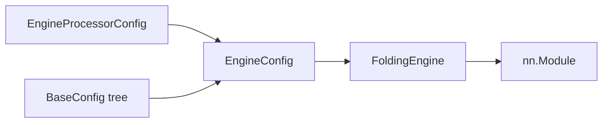
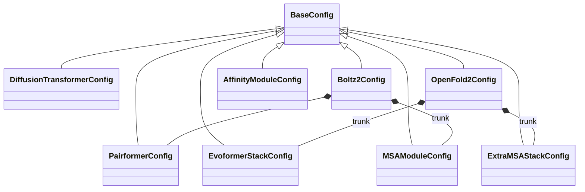
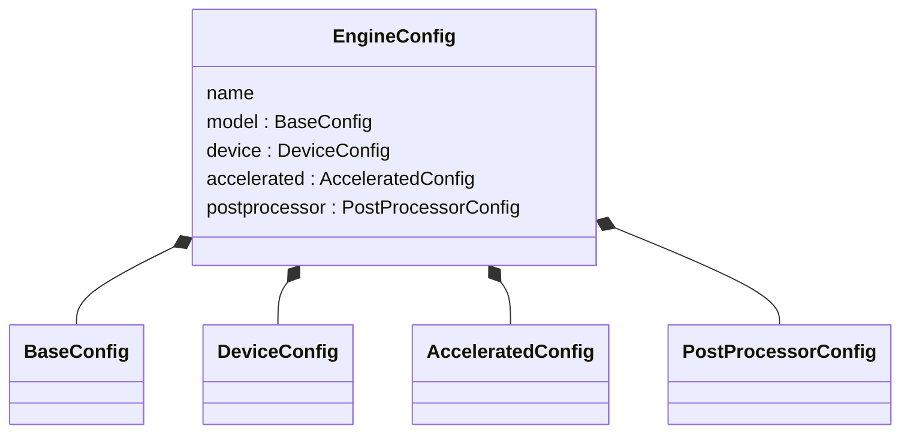
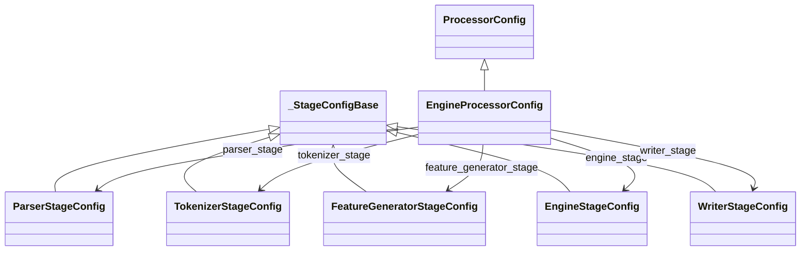

<!--
SPDX-FileCopyrightText: Copyright (c) 2026 NVIDIA CORPORATION & AFFILIATES. All rights reserved.
SPDX-License-Identifier: Apache-2.0
-->

# Config architecture

BioNeMo Inference Runtime (BioIR) has two pydantic trees. They do not
share types.

- **Model configs** describe the `nn.Module`. Every node is a
  `BaseConfig`.
- **Pipeline configs** describe the five-stage processor. The root is
  `EngineProcessorConfig`.

They meet at `EngineConfig`: the processor puts a model tree (or
`get_pretrained_config()`) next to device and acceleration settings,
then `FoldingEngine` builds the module. How to *call* that surface is
in the [API reference][api].



## Model configs

`bionemo_ir/configs/` holds shared types only. Family composites live
in `bionemo_ir/models/<family>/config.py` next to that family's
`PRETRAINED_CONFIG_REGISTRY`.

A Pairformer is a reusable layer. An MSA module, ExtraMSA stack, or
affinity head is a family-specific assembly of those layers — that is
why those three are not in `configs/modules.py`.



`Boltz1Config` reuses `MSAModuleConfig` from Boltz-2. Other family
roots (`OpenFold3Config`, `ProtenixConfig`, …) follow the same
pattern: inherit `BaseConfig`, compose primitives, keep family stacks
in the family file. Pretrained variants (`OpenFold2_FT2_Config`,
`AlphaFold2_1_Config`, `Boltz2AffinityConfig`, …) subclass the family
root.

`set_*` helpers (`set_dtype`, `set_triangle_attention_backend`, …)
walk the tree **by value**. Class defaults are not what a run uses —
`get_pretrained_config()` in `modeling.py` fills dtypes and backends.
`runtime_args` (`recycling_steps`, …) are a processor dict, not fields
on this tree.

`EngineConfig` does **not** inherit `BaseConfig`. It wraps one:



`FoldingEngineWrapper` fills `EngineConfig` from `engine_kwargs`
(`config`, `device`, `accelerated_configs`, `postprocessor_config`,
`profile_inference`). CUDA-graph wrap is
[architecture — acceleration][accel].

## Pipeline configs

`ProcessorConfig` is the executor (batch size, Ray vs serial).
`EngineProcessorConfig` adds the model key, `engine_kwargs`,
`runtime_args`, and one field per stage. Stage types all inherit
`_StageConfigBase`.



Each stage field accepts `bool`, `dict`, or a typed `*StageConfig`.
`True` means "run with processor defaults."
`resolve_stage_config()` is the only constructor `build_processor`
uses: copy a typed config, wrap a `bool`, or parse a `dict`, then fill
`None` fields from the processor (`batch_size`, `compute`,
`runtime_env`, `model_source`).

`build_processor` always runs all five stages. `enabled` is not a
public skip switch.

Stage extras: `init_context` on tokenizer / feature generator (set
`random_seed` on the **feature-generator** stage), `output_path` /
`format` on the writer, `parallelism_mode=REPLICA` and `num_gpus` on
the engine. Worked examples:
[API — `build_processor`][build-processor].

```text
EngineProcessorConfig
  ├─ *StageConfig          → five stages
  ├─ runtime_args          → model.forward kwargs
  └─ engine_kwargs.config  → BaseConfig → EngineConfig
```

## Related

- [API reference][api] — constructing a processor or an `nn.Module`.
- [Architecture][architecture] — stages, registry, acceleration.
- [Support matrix][support-matrix] — which keys have a pipeline.

[accel]: architecture.md#acceleration
[api]: api.md
[architecture]: architecture.md
[build-processor]: api.md#build_processor
[support-matrix]: support-matrix.md
