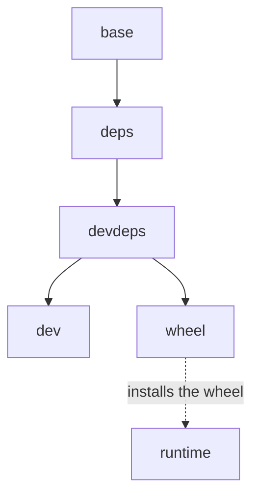

# Docker Images

In the BioNemo Inference Runtime (BioIR) repository,
`docker/Dockerfile` is the single source of truth for every image this project
builds. `docker/Makefile` wraps it; `.devcontainer/` consumes the `dev` target.

## Building

```bash
make -C docker help
make -C docker deps        # dependency-only image
make -C docker dev         # daily dev image
make -C docker wheel       # wheel into ./dist
make -C docker runtime     # minimal runtime image
make -C docker submodules  # check out the pinned third-party sources
```

- `deps` — runtime and dev dependencies, no source. Only `requirements*.txt`
  invalidates it, which is what makes it usable as a rolling CI build cache.
- `dev` — `deps` plus a user whose UID matches yours, for daily work on a GPU.
  [`docker/dev.sh`](#without-vs-code) build it with `TAG=dev-<dirname>` so each
  worktree gets its own image, then runs the container and enter it.
- `wheel` — copies the source in with a `COPY .`, so `.dockerignore` has to stay
  accurate; builds the wheel and writes it to `./dist`.
- `runtime` — that wheel on a minimal CUDA base, for end-to-end tests and for
  deploying.
- `submodules` — builds nothing; runs `git submodule update --init --recursive`.

Base images are overridable:

```bash
make -C docker dev BASE_IMAGE=nvcr.io/nvidia/pytorch BASE_TAG=26.05-py3
```

`deps` deliberately is not. It builds from the Dockerfile's digest-pinned
default base, which is the compile identity the tracked CUBIN packs were built
against; a `--build-arg` there would let a rebased image claim it. `BASE_TAG`
still names the `deps` tag, though, so passing it renames the image without
changing its base — pass it only to label a build you know matches the pin.

`nvcc` never compiles CUDA here — the kernels ship precompiled, and it is only
read to stamp the wheel's `+cuXYZ` local version. `CUDA_TAG` overrides that, and
`BUILD_JOBS` caps the compile parallelism:

```bash
make -C docker wheel CUDA_TAG=cu130 BUILD_JOBS=8
```

Below is the Dockerfile stages graph



## Daily Development

The `dev` image carries the dependencies and no source: the checkout is
bind-mounted, so edits on the host are live and the image stays valid across
branches. Install the package once per container:

```bash
pip install -e '.[dev]'
```

### VS Code Dev Container

The [Dev Containers][devcontainers] extension's "Reopen in Container" builds the
`dev` target through Compose and, on first create, runs that install plus
`prek install`. C++ IntelliSense stays empty until you have built once — the
install writes the `compile_commands.json` that `.clangd` reads. Delete `build/`
to force a clean configure.

### Without VS Code

From anywhere in the worktree:

```bash
docker/dev.sh
```

It builds the image, then starts or joins a long-lived container named after the
worktree directory, so a second terminal joins the shell already running.
`docker/dev.sh --help` lists the flags and the environment variables.

It mounts the same host directories the dev container does:

| Host                  | Container     | Holds                                                 |
| --------------------- | ------------- | ----------------------------------------------------- |
| the worktree          | `/bioir`      | the checkout, `build/`, the compiled `*.so`           |
| `<cache>/cache`       | `/cache`      | ccache, the pip cache, compiled kernels, bash history |
| `<cache>/home-cache`  | `~/.cache`    | HuggingFace hub files, torch hub, `prek` environments |
| `~/.cache/bionemo_ir` | the same path | staged checkpoints and raw downloads                  |

`<cache>` is `bionemo-ir-dev` under `XDG_CACHE_HOME`, or under `~/.cache` when
that is unset, and is **shared by every worktree**; `BIOIR_HOST_CACHE` moves it.
The weight cache is mounted at the same absolute path on both sides, so a fetch
on the host and a fetch in the container fill the same one. `BIOIR_CACHE` is
read when the container is created — change it with `docker/dev.sh --reset`.

`HF_TOKEN`, `HUGGING_FACE_HUB_TOKEN`, `BIOIR_NGC_ORG`, `BIOIR_NGC_TEAM` and
`NGC_API_KEY` are passed through when set. GPUs are attached when the host has
the NVIDIA container runtime; `BIOIR_GPUS` overrides that (`none`, `all`,
`"device=0"`).

## Minimal Runtime Image

`runtime` installs the built wheel onto `nvidia/cuda:*-base`, adding `gcc` and
the Python headers for Triton JIT compilation.

```bash
make -C docker runtime TAG=local
docker run --rm --gpus all bionemo-ir:runtime-local \
    python -c "import bionemo_ir; print(bionemo_ir.__version__)"
```

`runtime` is used for testing and deploying the `wheel` with minimal image size.
To run folding with it, mount the data and weights inside the container, e.g:

```bash
docker run --rm --gpus all \
    --shm-size 10g \
    --user "$(id -u):$(id -g)" --env HOME=/tmp/bioir \
    --env "USER=$(id -un)" --env "LOGNAME=$(id -un)" \
    --volume "$HOME/.cache:/tmp/bioir/.cache" \
    --volume "$HOME/.cache/bionemo_ir:$HOME/.cache/bionemo_ir" \
    --env "BIOIR_CACHE=$HOME/.cache/bionemo_ir" \
    --env BIOIR_KERNEL_CACHE_DIR=/tmp/bioir/.cache/bioir-kernels \
    --volume "$PWD:/repo:ro" \
    --workdir /tmp \
    bionemo-ir:runtime-local \
    python /repo/examples/folding/run_demo.py
```

Stage the weights first with [`scripts/fetch_weights.sh`][fetch]

[devcontainers]: https://marketplace.visualstudio.com/items?itemName=ms-vscode-remote.remote-containers
[fetch]: ../../scripts/fetch_weights.sh
