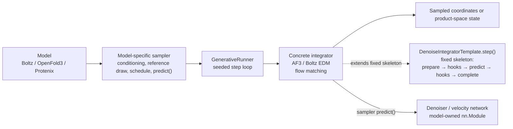

# Sampling architecture

BioNeMo Inference Runtime (BioIR) uses a Torch-native runtime for iterative
generative sampling. Model samplers own model-specific conditioning and
prediction calls, while `_torch/sampling` owns reusable rollout contracts,
iteration, random state, hooks, and integration algorithms.

## Overview



The Template Method separates the invariant `step()` skeleton from
algorithm- and model-specific operations. Each concrete integrator implements
those operations directly. OpenFold3 and Protenix use `AF3EDMIntegrator` with
tensor state, Boltz uses `BoltzEDMIntegrator` with structured state,
and `FlowMatchingIntegrator` provides the default product-space flow.

## Ownership boundaries

### Model

The top-level model owns trunk execution, model configuration, checkpoint
loading, and the denoising neural network. The denoiser remains an `nn.Module`
and is injected into the model-specific sampler:

```python
diffusion_module = DiffusionModule(config=...)
diffusion_sampler = ModelDiffusionSampler(
    config=...,
    diffusion_module=diffusion_module,
)
```

This keeps neural weights separate from rollout orchestration and allows
optimized submodules to be replaced through the model registry.

### Model-specific sampler

The sampler adapts the model to the shared runtime. It:

- prepares model-specific conditioning and masks;
- draws the initial state the rollout starts from;
- creates the rollout plan and `SamplingContext`;
- binds invariant tensors into a `predict(model_input, time)` closure;
- selects the concrete integrator and hooks;
- decodes the final runtime state into the model's public output.

The expensive denoiser call remains model-specific. The step loop does not.

### `GenerativeRunner`

`GenerativeRunner` owns algorithm-independent rollout mechanics:

1. initialize state through the integrator;
1. iterate for `integrator.num_steps(plan)`;
1. update `context.step_index`;
1. honor cancellation;
1. return `SamplingResult` with the final state and seed.

The runner does not know whether a prediction is denoised coordinates,
velocity, token logits, or a model-specific structured object.

### Integrator

`DenoiseIntegratorTemplate` fixes the denoiser-driven step order:

```text
prepare step
  -> before-denoise hooks
  -> extract model input and time
  -> predict
  -> attach prediction
  -> after-denoise hooks
  -> complete mathematical update
```

Concrete integrators implement this contract directly:

- `AF3EDMIntegrator` implements the AF3-style first-order EDM algorithm over
  coordinate tensors for OpenFold3 and Protenix.
- `BoltzEDMIntegrator` implements the same template for Boltz's structured
  state, including atom masks, previous denoised coordinates, and token
  representations.
- `FlowMatchingIntegrator` implements deterministic Euler over a dict of
  per-modality tensors with linear-interpolant clean endpoints.

None reimplements `step()`. Each supplies the template's typed operations:
initialization, step preparation, model inputs, prediction attachment, and the
mathematical update.

### Hooks

`DenoiseHookPipeline` applies ordered extensions around each prediction call.
Boltz uses hooks for:

- random rigid augmentation;
- churn-noise injection;
- potential guidance and particle resampling;
- token-representation accumulation;
- optional rigid alignment.

Hook constructors own rollout-local configuration and mutable state. Random
operations receive the explicit generator from `SamplingContext`.

## EDM step

The EDM implementation follows the first-order portion of Algorithm 2 from
Karras et al., [Elucidating the Design Space of Diffusion-Based Generative
Models](https://arxiv.org/pdf/2206.00364):

The initial coordinates are sampled at the largest noise level:

```math
\boldsymbol{x}_0 \sim
\mathcal{N}\!\left(\boldsymbol{0}, \sigma_0^2 \boldsymbol{I}\right).
```

Each sampling step temporarily adds noise, invokes the denoiser, and advances
toward the next noise level:

```math
\begin{aligned}
\hat{\sigma}_i
    &= \sigma_i \left(1 + \gamma_i\right), \\
\boldsymbol{\epsilon}_i
    &\sim \mathcal{N}\!\left(\boldsymbol{0}, \boldsymbol{I}\right), \\
\hat{\boldsymbol{x}}_i
    &= \boldsymbol{x}_i
       + s_{\mathrm{noise}}
         \sqrt{\hat{\sigma}_i^2 - \sigma_i^2}\,
         \boldsymbol{\epsilon}_i, \\
\boldsymbol{x}^{\mathrm{denoised}}_i
    &= \operatorname{predict}
       \left(\hat{\boldsymbol{x}}_i, \hat{\sigma}_i\right), \\
\boldsymbol{d}_i
    &= \frac{
         \hat{\boldsymbol{x}}_i
         - \boldsymbol{x}^{\mathrm{denoised}}_i
       }{\hat{\sigma}_i}, \\
\boldsymbol{x}_{i+1}
    &= \hat{\boldsymbol{x}}_i
       + s_{\mathrm{step}}
         \left(\sigma_{i+1} - \hat{\sigma}_i\right)
         \boldsymbol{d}_i .
\end{aligned}
```

In the implementation, `noise_scale` supplies the noise multiplier and
`step_scale` supplies the Euler-step multiplier.

This is the AF3/Boltz first-order adaptation, not the paper's full Heun
sampler. It intentionally omits Algorithm 2's second denoiser evaluation and
second-order correction. Churn gating, `step_scale`, rigid augmentation, and
model hooks follow model-specific inference algorithms.

## Model specializations

### OpenFold3 and Protenix

OpenFold3 and Protenix use:

- `EDMRolloutPlan`;
- `AF3EDMIntegrator`;
- a model-specific `predict` closure around their `DiffusionModule`.

Their differences remain in denoiser signatures, conditioning, schedule
termination, and optional caches.

### Boltz

Boltz uses:

- `EDMRolloutPlan` with an appended terminal zero;
- `BoltzEDMIntegrator`;
- a model-specific ordered hook pipeline;
- a chunked `predict` closure around its injected `DiffusionModule`.

This preserves steering, resampling, alignment, token accumulation, and sample
chunking without duplicating the EDM loop.

## Flow-matching step

Flow matching transports a reference sample to a data sample along a
time-parameterized path. For the linear (conditional optimal-transport)
interpolant used here,

```math
\boldsymbol{x}_t = t\,\boldsymbol{x}_1 + (1 - t)\,\boldsymbol{x}_0 ,
```

the network predicts the velocity `v = dx_t/dt`. One interval is an Euler step,
and the clean endpoint implied by a velocity follows from differentiating the
interpolant:

```math
\begin{aligned}
\boldsymbol{v}_i
    &= \operatorname{predict}\left(\boldsymbol{x}_i, t_i\right), \\
\boldsymbol{x}^{\mathrm{clean}}_i
    &= \boldsymbol{x}_i + \left(1 - t_i\right) \boldsymbol{v}_i, \\
\boldsymbol{x}_{i+1}
    &= \boldsymbol{x}_i
       + s_{\mathrm{step}} \left(t_{i+1} - t_i\right) \boldsymbol{v}_i .
\end{aligned}
```

Time *increases* toward data at `t = 1`, the opposite direction to EDM's
decreasing noise levels. The clean endpoint is both a rollout output and, when
`self_condition` is enabled, the next step's self-conditioning input; it is
zero-filled before the first prediction, so self-conditioning is inactive on
step 0.

Sampling is *product-space*: a model may evolve several modalities on their own
time grids through one shared network evaluation, so states, times, and
velocities are keyed by modality name. `FlowMatchingRolloutPlan` requires every
modality to use the same number of intervals.

### Reference distribution

The rollout needs a sample at `t = 0` before the first interval. The shared
runtime does not draw it. Shapes, padding, and centering are model-specific in
a way generic code cannot guess, so `FlowMatchingIntegrator` accepts an
`initial_value` supplied by the model.

This keeps the two ends of the path in different layers: `_torch/sampling` owns
the transport from `t = 0` to `t = 1`, and the model owns what `t = 0` means.

## Source layout

```text
bionemo_ir/_torch/sampling/
  contracts.py             shared types, plans, context, and protocols
  runner.py                algorithm-independent rollout loop
  denoise_integrator.py    invariant denoiser-step ordering
  hooks.py                 ordered before/after-denoise hooks
  edm.py                   EDM schedule, math, and tensor integrator
  flow_matching.py         flow schedule, math, and product-space integrator
```

Model-specific rollout code lives directly beside its model.
